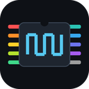
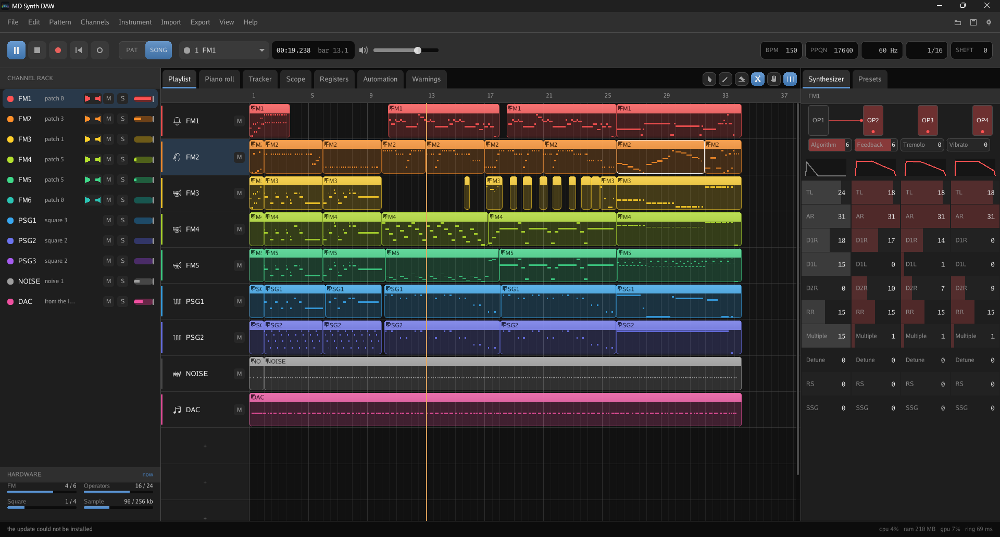

*This project is in pre-release state, expect bugs still*

<a id="readme-top"></a>

<div align="center">

# MD Synth DAW
**Write music for the Sega Mega Drive / Genesis or just make music with the same constraints as the console.**



[![Haxe][haxe-shield]][haxe-url]
[![hxcpp][hxcpp-shield]][hxcpp-url]
[![SDL3][sdl-shield]][sdl-url]
[![Platforms][platform-shield]](#getting-started)
[![Licence][licence-shield]][licence-url]

[![MSVC][msvc-shield]](docs/BUILDING.md#toolchains)
[![clang-cl][clangcl-shield]](docs/BUILDING.md#toolchains)
[![MinGW][mingw-shield]](docs/BUILDING.md#toolchains)
[![Clang][clang-shield]](docs/BUILDING.md#toolchains)
[![GCC][gcc-shield]](docs/BUILDING.md#toolchains)

[Getting Started](#getting-started) ·
[What It Supports](#what-it-supports) ·
[Every Feature](docs/FEATURES.md) ·
[Chip Accuracy](#chip-accuracy) ·
[References And Credits](#references-and-credits)

</div>

<details>
  <summary>Table of Contents</summary>

- [About The Project](#about-the-project)
  - [Small, and no runtime to install](#small-and-no-runtime-to-install)
  - [Built With](#built-with)
- [System Requirements](#system-requirements)
- [Getting Started](#getting-started)
  - [Install](#install)
  - [Verifying a download](#verifying-a-download)
  - [Build from source](#build-from-source)
- [What It Supports](#what-it-supports)
  - [Composing](#composing)
  - [Watching The Hardware](#watching-the-hardware)
  - [Importing](#importing)
  - [Exporting](#exporting)
  - [Other](#other)
- [Usage](#usage)
- [Chip Accuracy](#chip-accuracy)
- [What It Deliberately Is Not](#what-it-deliberately-is-not)
- [References And Credits](#references-and-credits)
  - [Hardware documentation](#hardware-documentation)
  - [The reference core](#the-reference-core)
  - [Libraries](#libraries)
  - [Typefaces](#typefaces)
  - [Icons](#icons)
  - [The shipped preset banks](#the-shipped-preset-banks)
- [Licence](#licence)
- [Contact](#contact)

</details>

## About The Project



The YM2612, the SN76489 and the sample channel are not an export format bolted on at the end. They
are the instruments, with all eleven channels the console actually has, and the program keeps the
hardware in front of you the whole time.

Draw a note the chip cannot sound and it is hatched in the piano roll straight away, with a warning
that clicks through to the note that caused it. Hover any FM parameter and it tells you the register
it writes, the raw value, and what that value means:

```
Total level   OP4   register $4C   value 12   -9 dB
```

And what you hear is what you get. One producer makes every register write in the program, and
playback, the export, the register timeline and the hardware meters all read from that same stream.
There is no second code path that could quietly drift, and the checks compare the live stream
against the offline one on every run.

### Small, and no runtime to install

The whole application is a **5 MB executable** sitting next to a copy of SDL. There is no runtime to
install, no framework, no .NET, no Electron, no Java, no redistributable. Download it, run it.

That is because almost none of it is somebody else's code:

- **The interface is written here.** No widget toolkit. Every panel, control and glyph is drawn by
  about 5,900 lines of this repository straight onto an SDL3 renderer, which is how the scope, the
  meters and the register timeline can redraw every frame while audio is being served.
- **The FLAC encoder is written here too**, in Haxe, in 717 lines: LPC prediction, rice partitioning
  and the MD5 signature, with no libFLAC anywhere. The signature it writes matches libFLAC's for the
  same audio, and the reference decoder verifies its files rather than warning about them.
- **The chip cores are written here**, from the part documentation and from measurement.

40,000 lines of Haxe and 5,900 of C++, all told. Most of what a packaged copy weighs is the bundled
typefaces rather than the program: the three CJK faces alone are 36 MB of the download, and they are
there so the interface has something to fall back to in any language.

### Built With

[![Haxe][haxe-shield]][haxe-url]
[![hxcpp][hxcpp-shield]][hxcpp-url]
[![SDL3][sdl-shield]][sdl-url]
[![miniaudio][miniaudio-shield]][miniaudio-url]

Haxe compiled to C++ through hxcpp. SDL3 and miniaudio are called directly rather than through a
game framework, because a framework is a place policy hides: the reason for calling them straight is
four behaviours found underneath one that nothing in the calling code said were true, including a
frame limiter that quietly delivered 43 updates a second when asked for 60.

<p align="right">(<a href="#readme-top">back to top</a>)</p>

## System Requirements

Approximate, and rounded up.

| | What it needs |
| --- | --- |
| **OS** | Windows 10 or 11, Linux, or macOS. Sixty-four bit only: there is no 32-bit build |
| **CPU** | Any x86-64 processor, two cores or better. Arm64 is built by CI but has not been run on hardware yet. Nothing beyond the baseline instruction set is asked for, so no AVX. Synthesis runs on one thread and the interface on another, which is why two cores is the floor |
| **RAM** | 512 MB free, 1 GB comfortable. An export wants more, and how much more grows with the length of the song |
| **GPU** | Direct3D 11 on Windows, OpenGL elsewhere. Integrated graphics is fine, because the interface is 2D and never touches a 3D pipeline |
| **Storage** | About 60 MB, plus your own projects. Most of that is the bundled typefaces; the program itself is 5 MB |

<p align="right">(<a href="#readme-top">back to top</a>)</p>

## Getting Started

### Install

Download the latest build from the [Releases page][releases-url], then either

- run the **installer**, or
- unzip the **portable archive** anywhere and run `mdd`.

Nothing else is needed. The portable archive keeps its settings beside itself rather than in your
account directory, so it will happily live on a USB stick with your preferences intact.

> **Heads up:** no release is published yet. Until the first one, build it from source. It is three
> commands.

### Verifying a download

Every release file is signed with [Sigstore][sigstore-url] as it is built, keylessly, so there is no
signing key to trust and none to leak. A `SHA256SUMS` file goes out beside them. Check one either
way:

```sh
# with the GitHub CLI, which checks the build provenance as well
gh attestation verify mdd-0.1.0-linux-x86_64.tar.gz --repo MeguminBOT/md-synth-daw

# or with cosign alone, against the bundle published beside the file
cosign verify-blob mdd-0.1.0-linux-x86_64.tar.gz   --bundle mdd-0.1.0-linux-x86_64.tar.gz.sigstore   --certificate-identity-regexp '^https://github.com/MeguminBOT/md-synth-daw/'   --certificate-oidc-issuer https://token.actions.githubusercontent.com
```

Either one tells you the file came out of this repository's release workflow, at a named commit, and
has not been touched since.

### Build from source

```sh
git clone https://github.com/MeguminBOT/md-synth-daw.git
cd md-synth-daw
./mdd setup     # SDL3, miniaudio, stb, the codecs and the typefaces into vendor/
./mdd run       # build it and start it
```

Prerequisites, toolchains, the build file and how to add a check are all in
**[docs/BUILDING.md](docs/BUILDING.md)**.

<p align="right">(<a href="#readme-top">back to top</a>)</p>

## What It Supports

The short list is below. **[docs/FEATURES.md](docs/FEATURES.md)** is the long one: everything the
application does, and an honest list of what it does not do and why.

### Composing

- **Eleven fixed parts**, the ones the machine has: six FM channels, three squares, the noise and
  the sample channel. Each keeps its own colour everywhere it turns up.
- **A playlist** of clips over named tracks, each track carrying a colour and an icon of its own.
- **A piano roll** with parameter lanes underneath it, a scale and key, snap, and zoom to fit.
- **A tracker view** of the same pattern data, in hexadecimal rows, if that is how you think.
- **An automation editor** holding every lane a channel has, folded and scrolled, with point shapes
  that curve into the next point.
- **An FM operator editor** with the algorithm drawn as separate wires rather than one line through
  every box, and a square editor beside it.
- **Preset banks** you can search by name or by tag, and any patch in a song can be lifted into the
  library.
- **Undo and redo on everything**, drags included, which land as one step rather than one a frame.

### Watching The Hardware

- **A register timeline**, saying which chip took each write.
- **A scope** that switches between waveform and spectrum.
- **A hardware meter** for what the song is asking of the parts.
- **Warnings that link to their cause.** Click one and it selects the channel and the note.
- **Three output stages**: the chip alone, the Mega Drive, or the Mega Drive 2.

### Importing

| Format | What comes across |
| --- | --- |
| **VGM** | The register stream becomes notes, patches, square envelopes and samples. Timing is kept as the file wrote it rather than a tempo being guessed at, and the exact frequency word is recorded at every key on, so vibrato and slides survive |
| **XGM** | Patterns and samples |
| **MIDI** | Notes and tempo |
| **WAV** | Samples for the sample channel, resampled to the rate you ask for |
| **TFI** | A single patch |

### Exporting

- **VGM, XGM and MIDI.**
- **Audio as WAV, FLAC, Ogg Vorbis or Opus**, with sample rate, bit depth, channels, normalise,
  dither, leading and trailing silence, fade and metadata tags all set per export. Opus exposes its
  application mode, frame size and bitrate mode, so a file can be aimed at streaming or at local
  listening. The FLAC encoder is this repository's own.
- **Stems**, one file per part beside the mix, each scaled by the gain the mix worked out so
  the set of them sums back to it.
- **A project as a zip or as a folder**, byte identical between runs.

### Other

- **Plug in a MIDI keyboard** and it plays the channel you have selected.
- **It saves on its own** every five minutes by default, and only once something has changed.
- **Portable mode.** Drop a `portable.txt` beside the executable and it keeps its settings there
  instead of in your account directory.
- **A translatable interface.** Every string it shows comes from one table rather than from
  the code, so adding a language is a file rather than a change to the program.
- **Crash reports that name the Haxe line**, from a release build carrying no stack frames, written
  where your settings live.

<p align="right">(<a href="#readme-top">back to top</a>)</p>

### Languages

Pick one on the first run, or change it later in preferences. The interface falls back to
English for anything a language does not carry.

| Language | Code | Translated by |
| --- | --- | --- |
| English (United Kingdom) | `en-GB` | written here, and the language every other one is measured against |
| English (United States) | `en-US` | written here |
| Svenska | `sv-SE` | written by a speaker |
| Deutsch | `de-DE` | machine translated |
| Español | `es-ES` | machine translated |
| Français | `fr-FR` | machine translated |
| Polski | `pl-PL` | machine translated |
| Português (Brasil) | `pt-BR` | machine translated |
| Português (Portugal) | `pt-PT` | machine translated |
| Русский | `ru-RU` | machine translated |
| 日本語 | `ja-JP` | machine translated |
| 简体中文 | `zh-CN` | machine translated |
| 한국어 | `ko-KR` | machine translated |

**Ten of these were translated by an AI and have not been read by a native speaker.** They
were written to the terms each language's own music software uses rather than word by word
from the English, and the wording is checked for nothing worse than that. Expect some of it to
read oddly, and a few terms to be wrong outright. If one of them is your language, corrections
are welcome and are a single file: `assets/lang/<code>.json`, one string per line, no code to
touch and no build to understand. The sheet that asks for a language on the first run says
which of the two the one you pick is.

<p align="right">(<a href="#readme-top">back to top</a>)</p>

## Usage

| Key | What it does |
| --- | --- |
| `Space` | play or pause |
| `Ctrl+Space` | stop and rewind |
| `Ctrl+L` | loop the pattern |
| `Ctrl+Z`, `Ctrl+Y` | undo, redo |
| `Ctrl+S`, `Ctrl+O` | save, open |
| `Ctrl+E` | export a VGM |
| `Ctrl+Shift+E` | export audio |
| `Ctrl+,` | preferences |

In the piano roll, click to write a note, drag to move it, right click for what can be done to it,
middle drag to pan, and `Ctrl` with the wheel to zoom. Hold alt to drop the grid mid drag. Right
click the background for the scale and key, the snap, and zoom to fit.

Right click a channel in the rack to mute, solo, copy or paste its patch, or clear it. Right click a
track header to rename it, recolour it, give it an icon, clone it, reset it, or merge its clips.

<p align="right">(<a href="#readme-top">back to top</a>)</p>

## Chip Accuracy

The FM core is written from the part documentation and then measured against a known-good YM2612
rather than approximated by ear. `mdd gate chip` renders 1032 register scripts through both and
compares them sample for sample.

The reference is built as a separate program and only the samples it produces ever cross over, so
its LGPL licence never reaches this repository and the cores stay this project's own work.

The SN76489 has no fixture suite behind it, so `mdd gate psg` stands in for one: its documented
behaviour written out as assertions instead.

Everything the chips do here comes from documentation or from measurement against that reference.
Nothing was taken by reading somebody else's emulator and transcribing what it does, because a
number lifted out of one arrives with no way to tell a measurement from an approximation somebody
settled for.

`mdd gate` is the only claim of working that counts. It exits nonzero on any failure, and every
check from the render path onward has an offline half, because a host being right is not the same as
an engine being right.

<p align="right">(<a href="#readme-top">back to top</a>)</p>

## What It Deliberately Is Not

- **Not a general-purpose DAW.** No reverb, no filters, no parameter that does not correspond to a
  register on one of the two chips. The one pole at twenty hertz on the output is the coupling
  capacitor the real board has.
- **Not a plugin.** This is an application, and the reason it is one is that a plugin could not be
  it.
- **Not a second front end** on somebody else's interface toolkit.
- **Not an emulator.** No 68000, no Z80, no VDP. It produces and consumes a register stream; it does
  not pretend to be a console.

<p align="right">(<a href="#readme-top">back to top</a>)</p>

## References And Credits

Everything below was read, measured against, or shipped. Where a licence binds what may be done with
a source, that is noted.

### Hardware documentation

| Source | What it settled |
| --- | --- |
| Sega Genesis Technical Manual, YM2612 section | The part's own documentation, and the starting point for the FM core. Quoted in the notes both where it agrees with measurement and where it does not, because on the oscillator frequencies and on which register drives which operator it is wrong |
| [SGDK][sgdk-url] | How a real driver treats the busy bit, and the XGM format the importer and exporter read and write |
| [VGM format specification][vgm-url] | The register log format, its commands and its timing |

### The reference core

| Source | Licence | How it is used |
| --- | --- | --- |
| [Nuked-OPN2][nuked-url] | LGPL-2.1 | The known-good YM2612 the FM core is measured against, and a reverse engineering of the die that settled several behaviours in minutes that curve fitting never would. Built as a program of its own; only the samples it produces cross over, and it is never linked into anything shipped |

### Libraries

| Source | Licence | Role |
| --- | --- | --- |
| [SDL3][sdl-url] | zlib | Window, events and rendering. Shipped unaltered |
| [miniaudio][miniaudio-url] | public domain or MIT-0 | The audio device, called directly |
| [stb_truetype][stb-url] | public domain or MIT | Glyph rasterising |
| [libogg][ogg-url] | BSD-3-Clause | Ogg framing |
| [libvorbis][vorbis-url] | BSD-3-Clause | Ogg Vorbis encoding |
| [libopus][opus-url] | BSD-3-Clause | Opus encoding |

FLAC and WAV have no library behind them; both are written in this repository.

There is no MP3 encoder, and that is the same decision that keeps Nuked-OPN2 at arm's length. LAME
and shine are both LGPL, which would put the whole application under obligations it does not want.
Vorbis and Opus carry no such condition.

### Typefaces

| Faces | Licence | From |
| --- | --- | --- |
| [Go, Go Mono][gofonts-url] | BSD-3-Clause | go.googlesource.com/image |
| IBM Plex Sans and Mono, Inter, JetBrains Mono, Barlow Semi Condensed, Source Sans 3, Source Code Pro, Noto Sans and Noto Sans Mono, Fira Sans, Fira Code, Work Sans, Roboto Mono, Open Sans | SIL OFL 1.1 | [google/fonts][googlefonts-url] |
| Noto Sans JP, Noto Sans SC, Noto Sans KR | SIL OFL 1.1 | [google/fonts][googlefonts-url], for the CJK ranges the interface falls back to |

### Icons

The interface icons come from [Qlementine Icons][qlementine-url] under MIT, fetched as SVG at a
recorded commit and rasterised into atlases at build time, with the upstream licence shipped
alongside. Its instrument category is what made it the right set. A couple of icons a general set
has no reason to carry, `wave-saw` and `wave-noise`, are drawn in this repository.

### The shipped preset banks

The bundled FM patches were read out of VGM recordings of the soundtracks of Sonic the Hedgehog,
Sonic the Hedgehog 2, Sonic the Hedgehog 3 and Mickey Mania. A patch here is the value of a register
at a key on: an algorithm, a feedback, and ten numbers for each of four operators, so forty two bytes
of parameters that a chip is set to. They were read from recordings of the hardware rather than
copied from anybody's source. This repository records where they came from and claims nothing beyond
that.

<p align="right">(<a href="#readme-top">back to top</a>)</p>

## Licence

MIT. See [`LICENSE`](LICENSE).

Vendored sources are fetched by `mdd setup` and are not part of this repository. Their licences are
listed under [References And Credits](#references-and-credits).

## Contact

Project link: [https://github.com/MeguminBOT/md-synth-daw](https://github.com/MeguminBOT/md-synth-daw)

<p align="right">(<a href="#readme-top">back to top</a>)</p>

[haxe-shield]: https://img.shields.io/badge/Haxe-4.3-EA8220?style=for-the-badge
[haxe-url]: https://haxe.org
[hxcpp-shield]: https://img.shields.io/badge/hxcpp-C%2B%2B-6E4C9E?style=for-the-badge
[hxcpp-url]: https://lib.haxe.org/p/hxcpp
[sdl-shield]: https://img.shields.io/badge/SDL-3-2A6DB0?style=for-the-badge
[sdl-url]: https://github.com/libsdl-org/SDL
[miniaudio-shield]: https://img.shields.io/badge/miniaudio-device-2A6DB0?style=for-the-badge
[miniaudio-url]: https://github.com/mackron/miniaudio
[platform-shield]: https://img.shields.io/badge/windows%20%7C%20linux%20%7C%20macos-4B7A4B?style=for-the-badge
[licence-shield]: https://img.shields.io/badge/licence-MIT-4B7A4B?style=for-the-badge
[licence-url]: LICENSE
[msvc-shield]: https://img.shields.io/badge/MSVC-builds-5C2D91?style=flat-square
[clangcl-shield]: https://img.shields.io/badge/clang--cl-builds-D34A47?style=flat-square
[mingw-shield]: https://img.shields.io/badge/MinGW--w64-builds-2A6DB0?style=flat-square
[clang-shield]: https://img.shields.io/badge/Clang-builds-D34A47?style=flat-square
[gcc-shield]: https://img.shields.io/badge/GCC-builds-4B7A4B?style=flat-square
[releases-url]: https://github.com/MeguminBOT/md-synth-daw/releases
[sigstore-url]: https://www.sigstore.dev
[nuked-url]: https://github.com/nukeykt/Nuked-OPN2
[sgdk-url]: https://github.com/Stephane-D/SGDK
[vgm-url]: https://vgmrips.net/wiki/VGM_Specification
[stb-url]: https://github.com/nothings/stb
[ogg-url]: https://github.com/xiph/ogg
[vorbis-url]: https://github.com/xiph/vorbis
[opus-url]: https://github.com/xiph/opus
[gofonts-url]: https://go.dev/blog/go-fonts
[googlefonts-url]: https://github.com/google/fonts
[qlementine-url]: https://github.com/oclero/qlementine-icons
