# MD Synth DAW User Manual

This manual shows how to make music for the Sega Mega Drive's sound chips with MD Synth DAW. Part 1
explains what the hardware can and can't do, because everything in the app follows from it. Part 2
is a quick tour of the app, from the first start to getting music out. Part 3 goes further: advanced
automation, and the techniques composers use to get past what the hardware can't do on its own, each
with an example you can open, play and listen to.

## Contents

**[Part 1: Understanding the hardware and its limits](#part-1-understanding-the-hardware-and-its-limits)**

1. [The chips, and what can sound at once](#1-the-chips-and-what-can-sound-at-once)
2. [FM channels, operators and algorithms](#2-fm-channels-operators-and-algorithms)
3. [One LFO for the whole chip](#3-one-lfo-for-the-whole-chip)
4. [Left, right or both](#4-left-right-or-both)
5. [The squares and the noise channel](#5-the-squares-and-the-noise-channel)
6. [The sample channel](#6-the-sample-channel)
7. [How a song reaches the chips](#7-how-a-song-reaches-the-chips)
8. [The limits at a glance](#8-the-limits-at-a-glance)

**[Part 2: Using MD Synth DAW](#part-2-using-md-synth-daw)**

9. [The first start](#9-the-first-start)
10. [The window](#10-the-window)
11. [Your first notes](#11-your-first-notes)
12. [Patterns and the playlist](#12-patterns-and-the-playlist)
13. [The FM synthesizer](#13-the-fm-synthesizer)
14. [Squares and noise](#14-squares-and-noise)
15. [Samples and drum kits](#15-samples-and-drum-kits)
16. [Presets](#16-presets)
17. [Automation](#17-automation)
18. [Watching the console hardware](#18-watching-the-console-hardware)
19. [Importing and exporting](#19-importing-and-exporting)
20. [Preferences](#20-preferences)

**[Part 3: Advanced usage](#part-3-advanced-usage)**

21. [Advanced automation](#21-advanced-automation)
22. [Pitch bends](#22-pitch-bends)
23. [Gliding notes](#23-gliding-notes)
24. [Vibrato and tremolo](#24-vibrato-and-tremolo)
25. [Panning](#25-panning)
26. [Filters and distortion](#26-filters-and-distortion)
27. [Changing a preset while it plays](#27-changing-a-preset-while-it-plays)
28. [Preset swapping, and presets that move](#28-preset-swapping-and-presets-that-move)
29. [Chords and arpeggios](#29-chords-and-arpeggios)
30. [Echo and sidechain](#30-echo-and-sidechain)
31. [Squares, noise, drums and samples](#31-squares-noise-drums-and-samples)
32. [Every example](#32-every-example)
33. [Quick reference](#33-quick-reference)

---

# Part 1: Understanding the hardware and its limits

What the Mega Drive's sound hardware is, what it can play at once, and where its limits are.

---

## 1. The chips, and what can sound at once

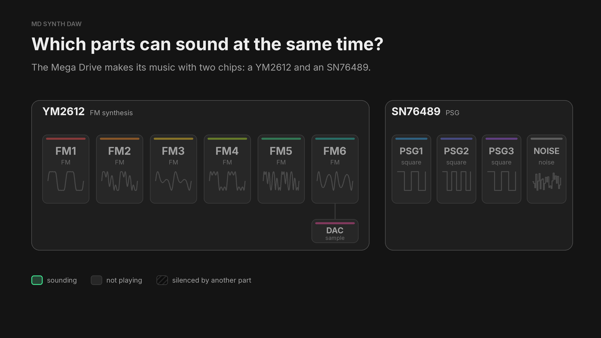

The Mega Drive makes its music with two chips. The **YM2612** has six FM channels, FM1 to FM6, each
a four operator FM voice. The **SN76489** has three square wave channels, PSG1 to PSG3, and a noise
channel. MD Synth DAW shows them in the channel rack as eleven parts: those ten, and the sample
channel, DAC.

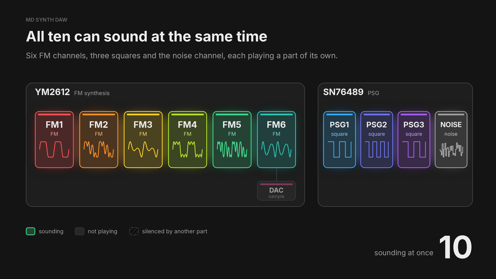

All ten can sound at the same time, each playing a part of its own.

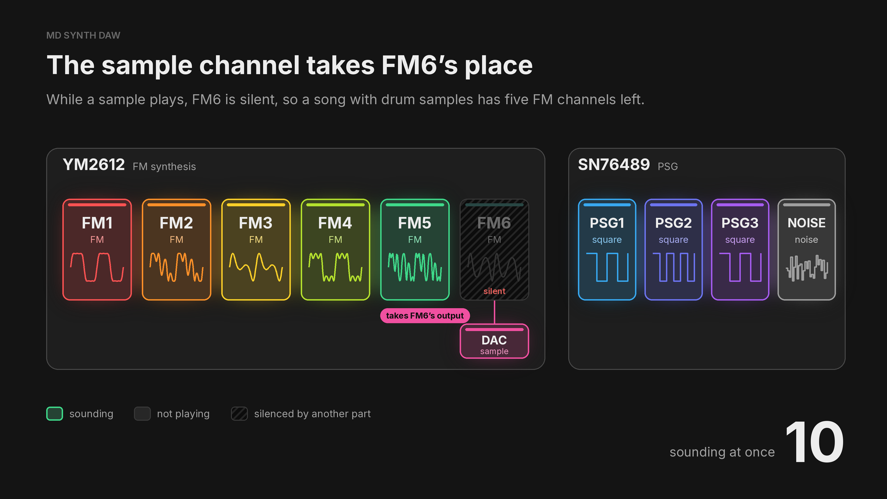

**The sample channel takes FM6's place.** While a sample plays, FM6 is silent, so a song with drum
samples has five FM channels left. [Sharing channel six](#sharing-channel-six) shows how to get
some of it back.

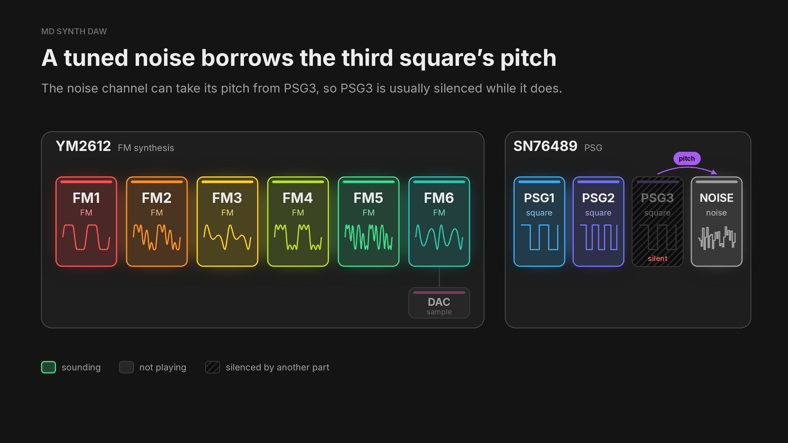

**A tuned noise borrows the third square's pitch.** The noise channel can take its pitch from PSG3,
so PSG3 is usually silent while it does. [Pitched noise](#pitched-noise) shows how.

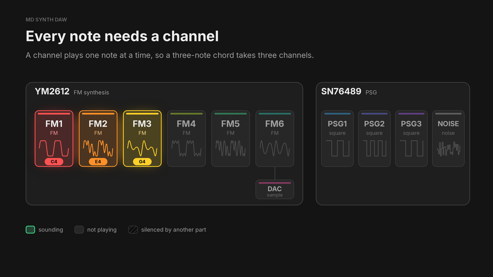

**Every note needs a channel.** A channel plays one note at a time, so a three note chord takes
three channels. There's one exception:

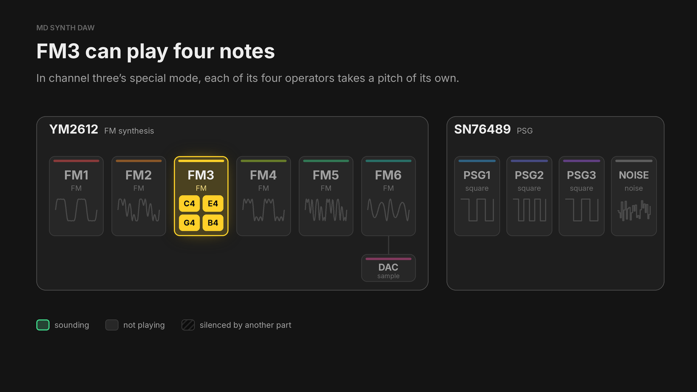

**FM3 can play four notes.** In channel three's special mode, each of its four operators takes a
pitch of its own. [FM3 four notes](#fm3-four-notes) shows how to switch it on.

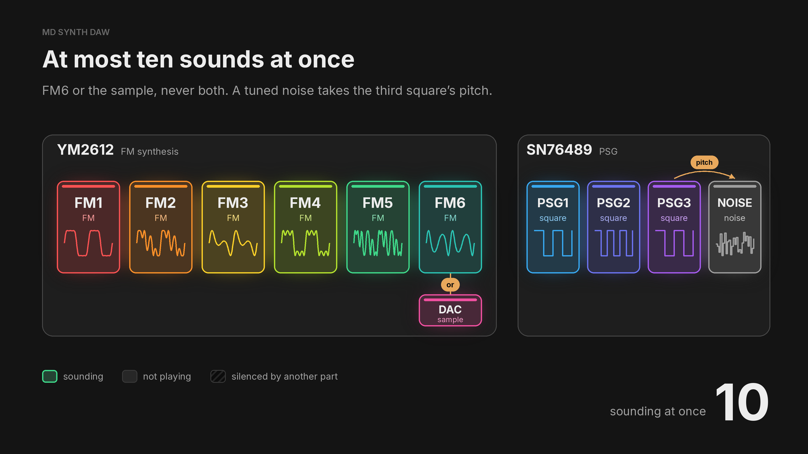

So at most ten sounds play at once: FM6 or the sample, never both, and a tuned noise takes the
third square's pitch.

(<a href="#top">back to top</a>)

---

## 2. FM channels, operators and algorithms

Each of the YM2612's six FM channels is one voice made of four **operators**. An operator is a sine
wave with an envelope of its own. The **algorithm** wires the four together: an operator that feeds
another is a **modulator**, and changes the tone of the one it feeds, while an operator that reaches
the output is a **carrier**, and is heard. Operator 1 can also feed back into itself, which makes the
sound brighter and rougher.

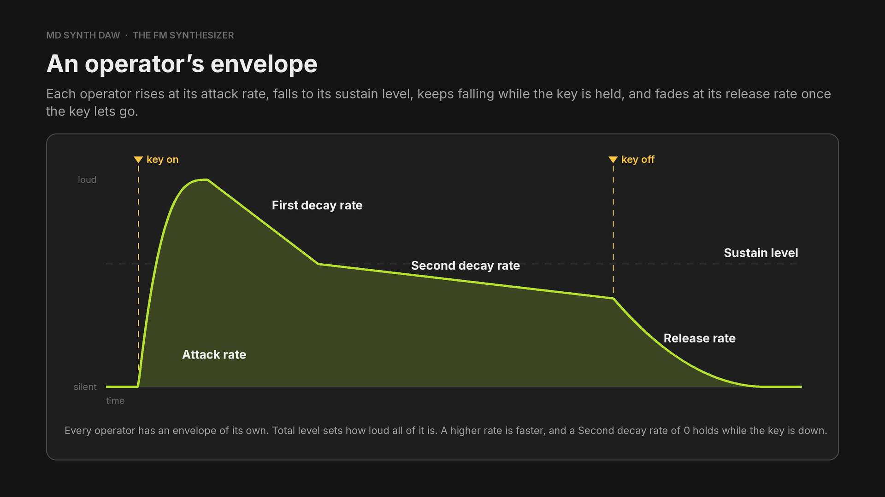

**Every operator has an envelope of its own.** It rises at its attack rate after the key on, falls
at its first decay rate to its sustain level, keeps falling at its second decay rate while the key
is held, and fades at its release rate once the key lets go. On a carrier the envelope shapes the
volume, and on a modulator the tone.

### Carriers are heard, modulators shape the tone

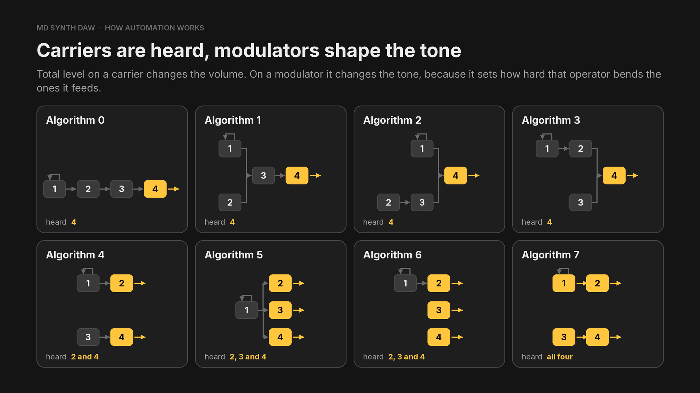

An operator's total level on a **carrier** changes the volume. On a **modulator** it changes the
tone, because it sets how hard that operator bends the ones it feeds. The algorithm decides which
operators are carriers.

| Algorithm | Carriers |
| --- | --- |
| 0 to 3 | 4 |
| 4 | 2 and 4 |
| 5 and 6 | 2, 3 and 4 |
| 7 | all four |

(<a href="#top">back to top</a>)

---

## 3. One LFO for the whole chip

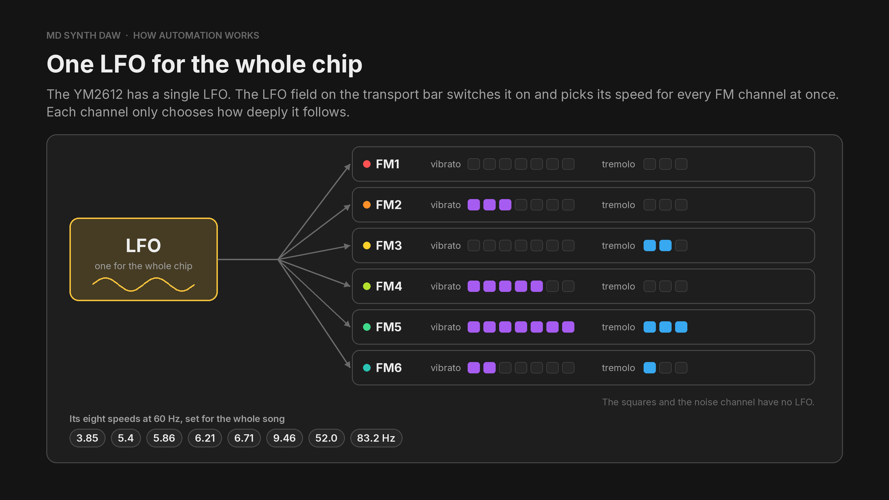

The YM2612 has a single LFO, a slow wave that can wobble the pitch (vibrato) and the volume
(tremolo). There is only one, so every FM channel that follows it wobbles at the same speed. The
**LFO** field on the transport bar switches it on and picks one of its eight speeds for the whole
song. A new project starts with it off. The squares and the noise channel have no LFO.

Its eight speeds at 60 Hz are 3.85, 5.4, 5.86, 6.21, 6.71, 9.46, 52.0 and 83.2 Hz. On a 50 Hz
console both chips run from a clock 0.9 per cent slower, and the LFO slows with them.

How deeply each channel follows it is set in the synthesizer: see
[Speed for the song, depth for the channel](#speed-for-the-song-depth-for-the-channel).

(<a href="#top">back to top</a>)

---

## 4. Left, right or both

An FM channel plays on the left output, the right, both, or neither, with nothing in between: the
YM2612 has one bit for each side, and no pan control. The squares and the noise channel have no
stereo at all on a stock console, so they always sound in the middle. A channel's two bits share a
register with its two LFO depths. [Panning](#25-panning) shows how to place a sound in between anyway.

(<a href="#top">back to top</a>)

---

## 5. The squares and the noise channel

The SN76489 has three square wave channels and a noise channel. Each has a volume in 16 levels, 2 dB
apart and the last of them silence, and nothing else: no attack, decay or release. A sound driver
makes an envelope by writing the volume again every frame, and that is what a square's preset is in
MD Synth DAW. The squares go no lower than about 109 Hz, a little below A2.

The noise channel plays **periodic** noise, a buzzing tone, or **white** noise, a hiss. It runs at
one of three fixed rates, or at a rate taken from the third square, which is how it plays a tune:

| Noise | Kind | Rate |
| --- | --- | --- |
| 0 | periodic | fastest fixed rate |
| 1 | periodic | middle fixed rate |
| 2 | periodic | slowest fixed rate |
| 3 | periodic | follows PSG3's pitch |
| 4 | white | fastest fixed rate |
| 5 | white | middle fixed rate |
| 6 | white | slowest fixed rate |
| 7 | white | follows PSG3's pitch |

On 3 or 7, notes written on NOISE play at their own pitch: see [Pitched noise](#pitched-noise).

(<a href="#top">back to top</a>)

---

## 6. The sample channel

The YM2612's sixth channel can be switched to a converter that plays recordings, a byte at a time.
It is one channel, so it plays one sample at a time, at the rate the sample was recorded, with no
pitch or volume control of its own, and FM6 is silent while it plays. A song with drum samples
therefore has five FM channels left. The recordings are stored in the cartridge, so their size counts
against the space the game has. [Sample stutter](#sample-stutter) and
[Sharing channel six](#sharing-channel-six) show how to make the most of it.

(<a href="#top">back to top</a>)

---

## 7. How a song reaches the chips

The chips don't play notes on their own. A program on the console, the **sound driver**, writes their
registers, and every change of sound is one of those writes: a key on, a new pitch, a new level.

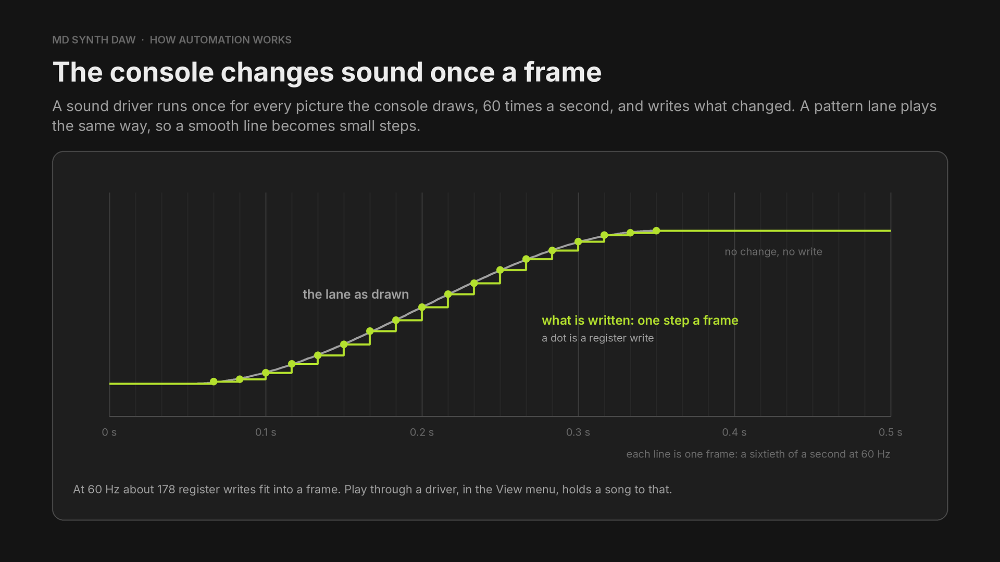

A sound driver on the console runs once for every picture the console draws, 60 times a second on
a 60 Hz console and 50 on a 50 Hz one, and writes whatever changed since the last time. So a change
that is smooth on paper, a slide or a fade, reaches the chips as small steps, one a frame. At 60 Hz
about 178 register writes fit into one frame, and a song that asks for more is heard arriving late.

Where a song plays changes how it sounds. A 50 Hz console, the one sold in Europe, runs its driver
fifty times a second instead of sixty, and its chips from a slightly slower clock. The board after
the chips filters the sound too, and the first and second models filter it differently.

| On the transport bar | How it plays |
| --- | --- |
| 60 Hz | a 60 Hz console, at the tempo you wrote |
| 50 Hz | a PAL console: five sixths of the tempo, and about 16 cents lower |

| Output stage, in Preferences, Sound | What it plays through |
| --- | --- |
| Chip alone | the chips, with no board after them |
| Mega Drive | the filtering of the first model's board |
| Mega Drive 2 | the filtering of the second model's board |

(<a href="#top">back to top</a>)

---

## 8. The limits at a glance

Every limit below has a way round it in [Part 3](#part-3-advanced-usage).

| Limit | Where to go |
| --- | --- |
| Six FM channels, or five with drum samples | [Preset swapping](#28-preset-swapping-and-presets-that-move), [FM drums](#fm-drums), [Sharing channel six](#sharing-channel-six) |
| One note per channel | [Chords and arpeggios](#29-chords-and-arpeggios) |
| One LFO for the whole chip | [Vibrato and tremolo](#24-vibrato-and-tremolo) |
| Left, right or both, with nothing in between | [Panning](#25-panning) |
| A note's pitch is fixed, with no portamento | [Pitch bends](#22-pitch-bends), [Gliding notes](#23-gliding-notes) |
| No filter, distortion, delay or compressor | [Filters and distortion](#26-filters-and-distortion), [Echo and sidechain](#30-echo-and-sidechain) |
| A preset is a fixed sound | [Changing a preset while it plays](#27-changing-a-preset-while-it-plays) |
| Squares have 16 volume levels and no envelope | [Square swells](#square-swells) |
| Noise has three fixed rates | [Pitched noise](#pitched-noise) |
| A sample plays at the rate it was recorded | [Sample stutter](#sample-stutter) |

(<a href="#top">back to top</a>)

---

# Part 2: Using MD Synth DAW

A quick tour of the app, from the first start to getting music out. If you've used FL Studio before,
you'll quickly get the hang of it, as most of its inspiration comes from there.

---

## 9. The first start

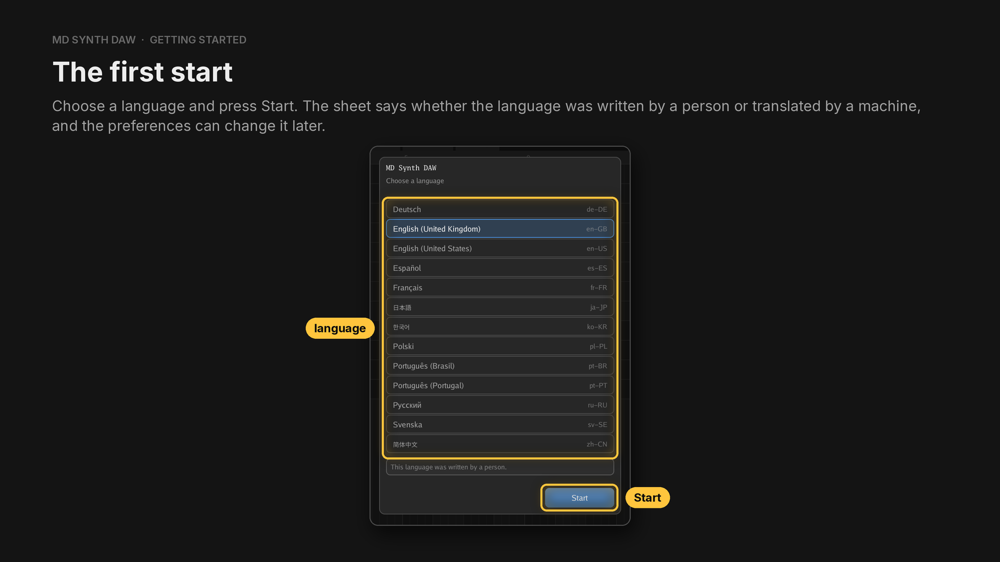

The first time MD Synth DAW starts, it asks two things. **Choose a language**: thirteen ship, and
the sheet says whether the one you pick was written by a person or translated by a machine. English
(UK and US) is written by people, and the rest are machine translated. Then **how would you like to
write automation**: **Lanes under the editor** puts it under the piano roll, and **Clips on the
playlist** puts it on the playlist as clips of its own. Press **Start**. The language can be changed
later in **Preferences**, **Look**, and the automation choice in **Preferences**, **Editing**.

(<a href="#top">back to top</a>)

---

## 10. The window

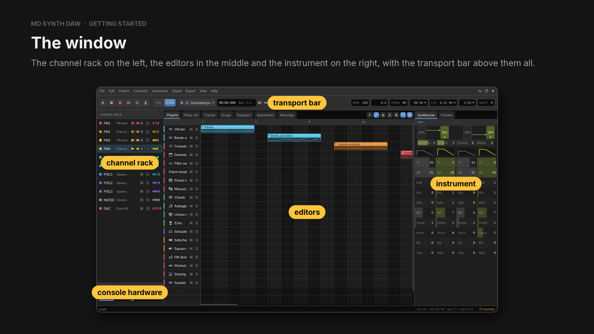

The **channel rack** is on the left, with the **console hardware** panel under it. The editors fill the
middle, and the **instrument** is on the right. The **transport bar** runs across the top, under the
menus.

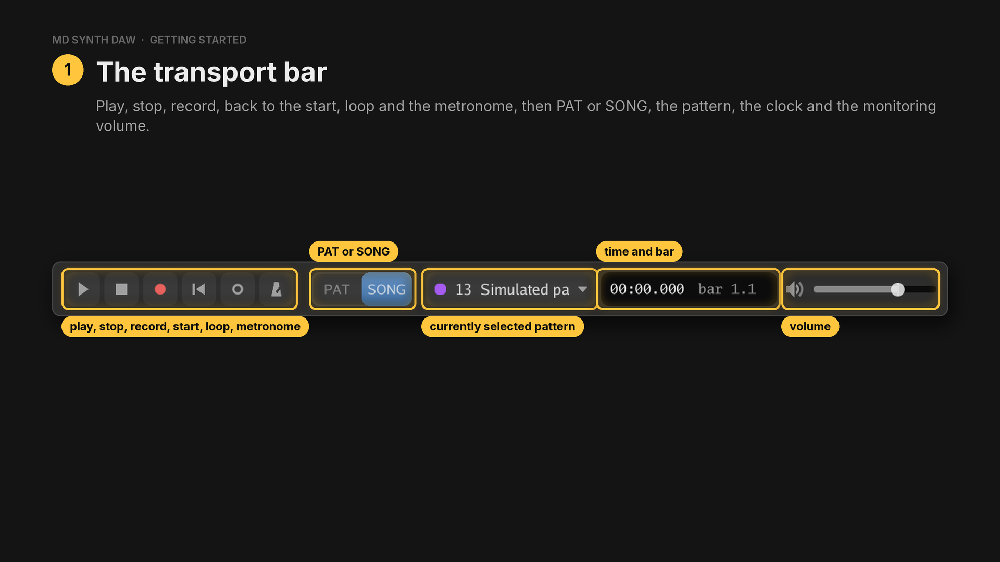

From the left, the transport bar has **Play**, **Stop and rewind**, **Record**, **Back to the
start**, **Loop** and the **metronome**. Then **PAT** and **SONG**, which play the chosen pattern on
its own or the whole song, the currently selected pattern, the clock with the bar the playhead is
in, and the monitoring volume. Click the pattern to pick another or make a new one. The monitoring
volume only changes what you hear, never what is exported.

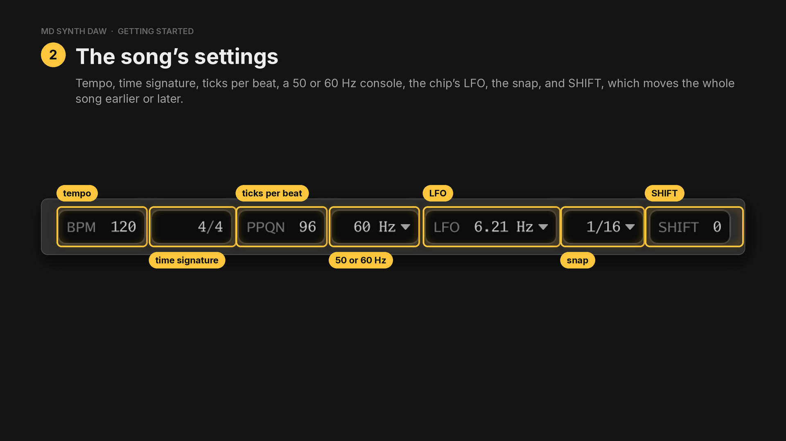

On the right are the song's own settings: the tempo in **BPM**, the time signature, **PPQN** (the
ticks in a quarter note), **50** or **60 Hz** for the console it plays on, the chip's **LFO**, the
snap, and **SHIFT**, which moves every note, clip and automation point in the song earlier or later
by a number of ticks.

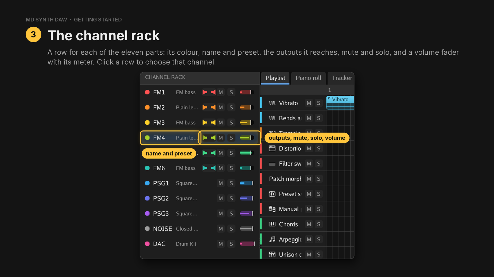

The **channel rack** has a row for each of the eleven parts: six FM channels, three squares, the
noise channel and the sample channel. Each row has its colour, its name, the preset it plays, the
outputs it reaches (FM channels only), **M** and **S** for mute and solo, and a volume fader with
its level meter inside. Click a row to choose that channel: the editors and the instrument work on
the chosen one. Right click a row for its menu.

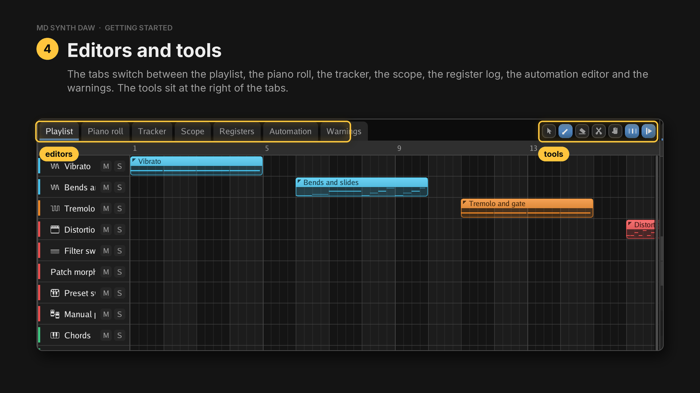

The tabs switch the editor: **Playlist**, **Piano roll**, **Tracker**, **Scope**, **Registers**,
**Automation** and **Warnings**. The tools sit at the right of the tabs, and each editor offers the
ones that make sense in it.

| Tool | Key | What it does |
| --- | --- | --- |
| Select | `E` | picks notes, clips or points, one at a time or with a box |
| Draw | `P` | writes notes, clips and points |
| Erase | `D` | takes away what you click or drag across |
| Slice | `C` | cuts a clip or a note in two |
| Pan | `H` | drags the view around |
| Snap to the grid | | turns the grid on and off |
| Follow playhead | | keeps the playhead in sight while a song plays |
| Notes on other channels | | shows the other channels' notes faintly in the piano roll |
| Keep the tracker to the pattern | | holds the tracker to the chosen pattern |

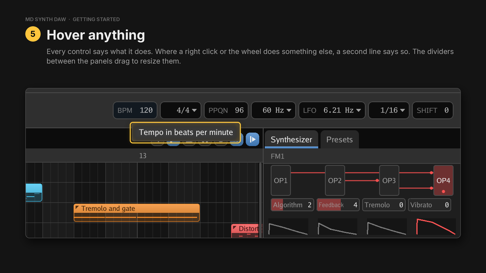

**Hover anything.** Every control says what it does, and where a right click or the wheel does
something else, a second line says so. The dividers between the panels drag to resize them. **Undo
and redo cover everything**, and a whole drag undoes as one step.

(<a href="#top">back to top</a>)

---

## 11. Your first notes

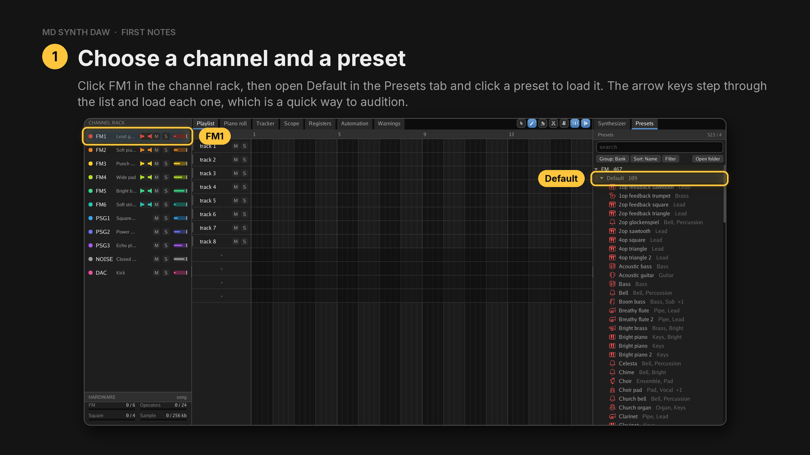

1. **Choose a channel and a preset.** Click **FM1** in the channel rack. In the **Presets** tab the
   banks start folded: open **Default** and click a preset to load it into FM1. The arrow keys step
   through the list, loading each one as they go, which is a quick way to audition sounds.

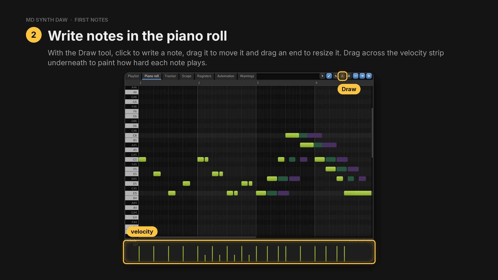

2. **Write notes.** Open the **Piano roll** and pick the **Draw** tool. Click to write a note, drag
   it to move it, and drag either end to resize it. Drag across the velocity strip under the roll to
   paint how hard each note plays.

3. **Play it.**

| Key | What it does |
| --- | --- |
| `Space` | play or pause |
| `Ctrl+Space` | stop and rewind |
| `Home` | back to the start |
| `Ctrl+L` | loop |
| `R` | record on or off |
| `Ctrl+M` | metronome on or off |

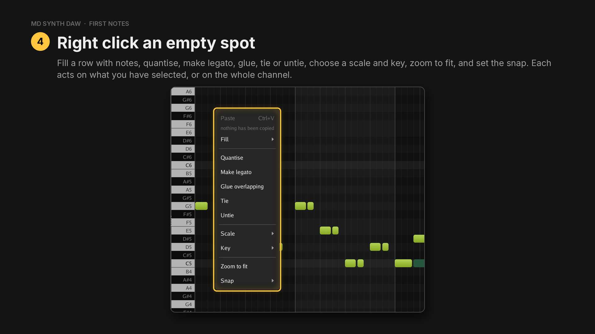

4. **Right click an empty spot** in the roll for **Fill** (a note on that row every step, every 2 or
   4 steps, every beat, every 2 beats or every bar), **Quantise**, **Make legato**, **Glue
   overlapping**, **Tie** and **Untie**, the **Scale** and **Key** (nine scales, twelve roots),
   **Zoom to fit** and the **Snap**. Each acts on what you have selected, or on the whole channel
   where nothing is.

**Edit faster** with the keyboard:

| Key | What it does |
| --- | --- |
| arrow keys | move the selected notes a semitone or a grid step |
| `Ctrl+Up`, `Ctrl+Down` | move them an octave |
| `Shift+Up`, `Shift+Down` | make them louder or quieter |
| `Ctrl+B` | lay a copy straight after the selection |
| `Shift` and a drag | carry a copy of a note, or of the selection |
| `Alt` while dragging | leave the grid |
| `Ctrl` and the wheel | zoom, or with `Shift`, make the rows taller or shorter |
| middle drag | move the view |

A note the chip can't sound is hatched straight away, with a warning that links to it.

### Playing and recording from a MIDI keyboard

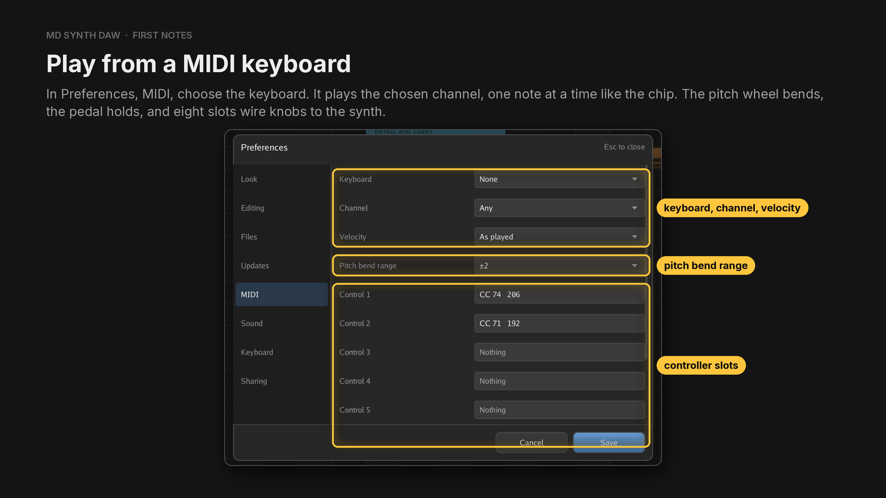

In **Preferences** (`Ctrl+,`), **MIDI**, choose the **Keyboard**, and leave **Channel** on **Any**
and **Velocity** on **As played**. The keyboard plays the chosen channel one note at a time, the way
the chip does: hold a key, play another and let it go, and the first comes back. The sustain pedal
holds notes, and the pitch wheel bends two semitones either way unless **Pitch bend range** says
otherwise. The eight controller slots wire a knob to a synth parameter: click one and move the knob.

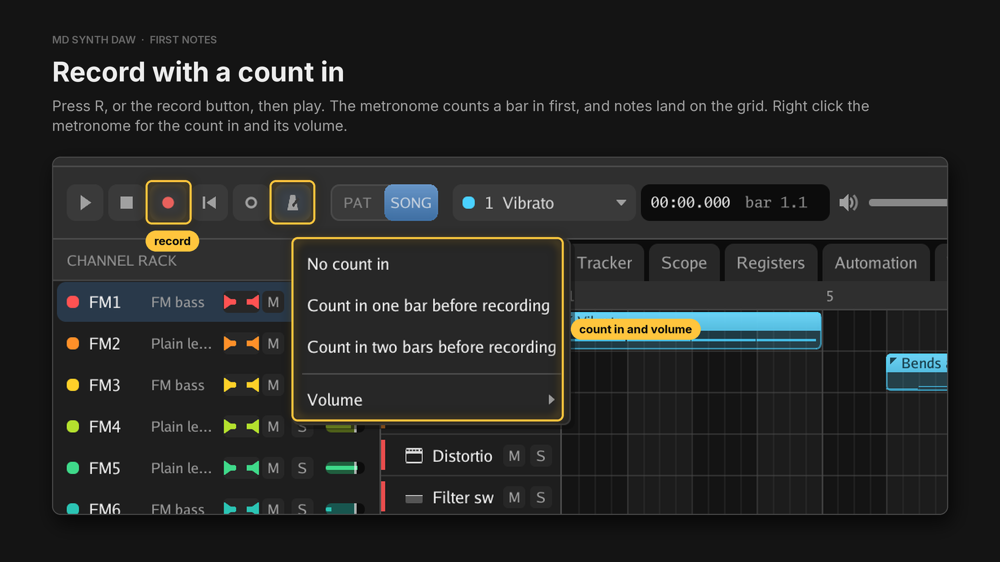

Press `R`, or the record button, then play. The metronome counts a bar in first, the readout beside
the clock counts the beats, and every key lands on the nearest grid line. Stop, then `Ctrl+Z`, and
the whole take goes in one step. Right click the metronome for the count in (none, one bar or two)
and its **Volume**. With the song stopped and record on, each key writes one note a grid step long
and moves the playhead on, so a line can be entered one note at a time.

(<a href="#top">back to top</a>)

---

## 12. Patterns and the playlist

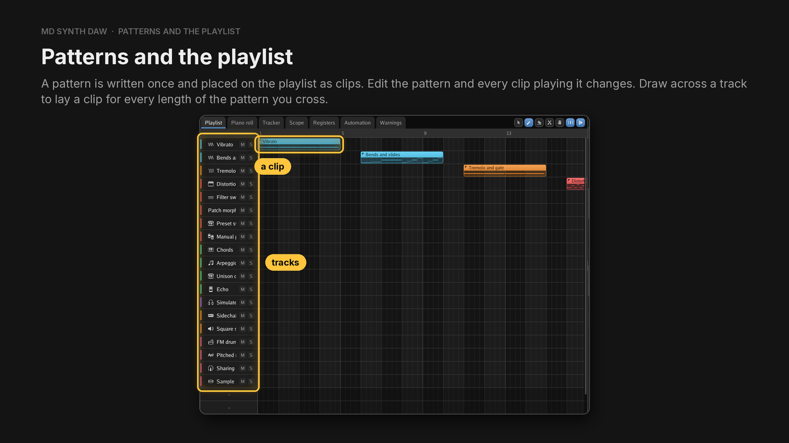

A **pattern** holds notes for any of the eleven channels. The **playlist** places it as clips on
named tracks. Write a pattern once and place it as often as you like: edit it, and every clip playing
it changes. With **Draw**, press and drag across a track to lay a clip for every length of the
pattern you cross, so four bars is one stroke. Clips drag between tracks, resize, slice in two and
move together as a group, and slicing one keeps the music where it was rather than restarting the
pattern. Double click a clip to open it in its editor.

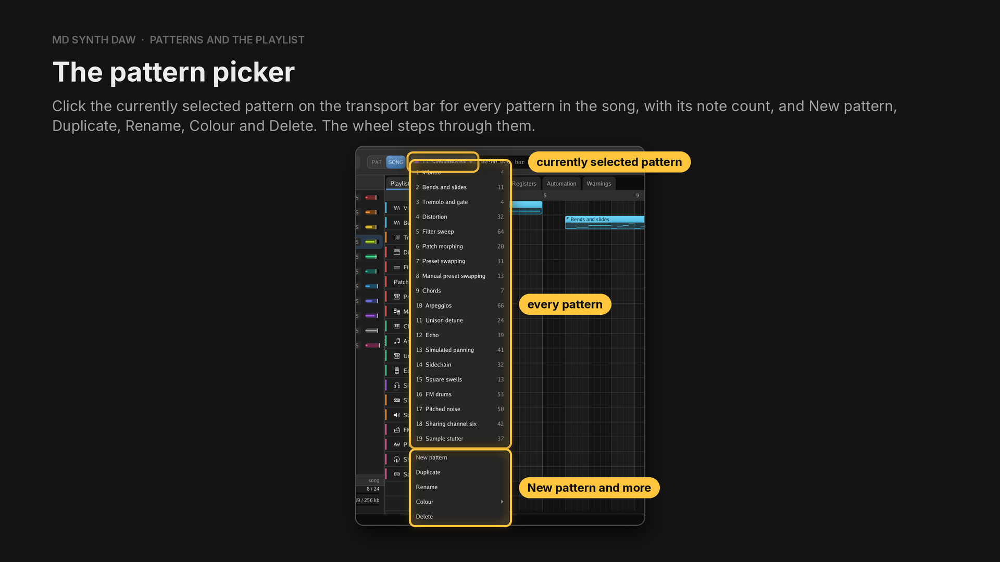

The **pattern picker** on the transport bar shows the currently selected pattern, which is the one
the editors show. Click it for every pattern in the song, with how many notes each holds, and
**New pattern**, **Duplicate**, **Rename**, **Colour** and **Delete** at the bottom. Turn the wheel
over it to step through the patterns. The **Pattern** menu has the same commands, and a few more:

| Entry | What it does |
| --- | --- |
| New pattern, Duplicate, Rename | make and name patterns |
| Add to the playlist | put a clip of it after the last clip on the first track |
| Delete | take it out, with every clip that plays it |
| Play it on | move a pattern that holds one channel's notes onto another channel |
| Time signature | give the pattern one of its own, or follow the song |
| Clear every channel | empty it |

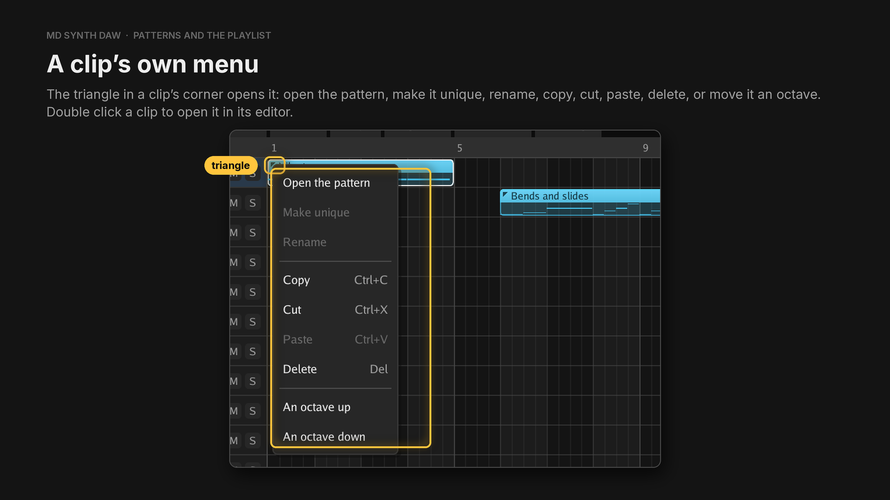

The **triangle in a clip's corner** opens its menu: open the pattern, make it unique, rename it,
copy, cut, paste, delete, or move it an octave.

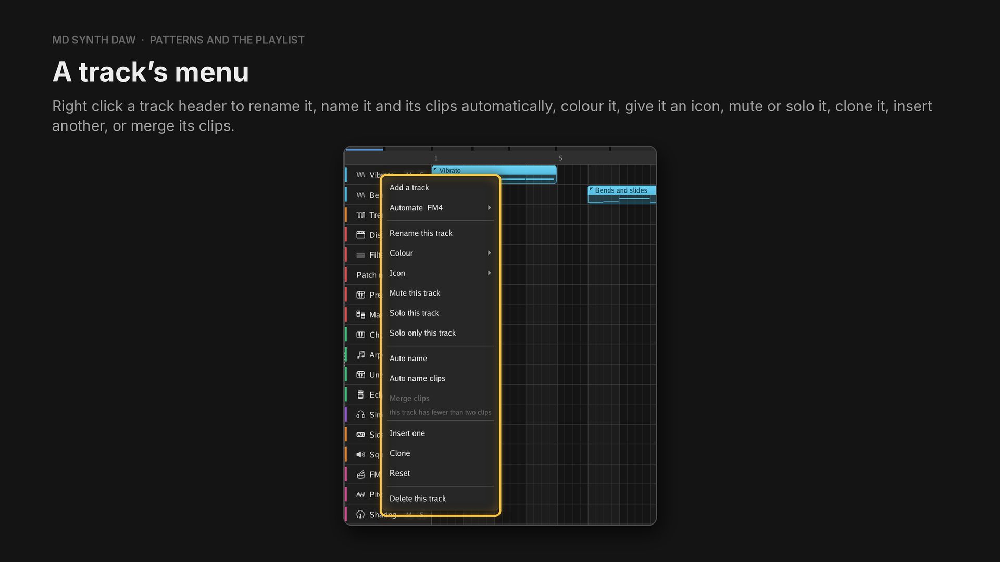

**Right click a track header** to add a track, rename it, name it and its clips automatically,
colour it, give it an icon, mute or solo it, solo it alone, clone it, insert another, reset it,
merge its clips or delete it. `Alt` and a click on a solo button solos that track alone.

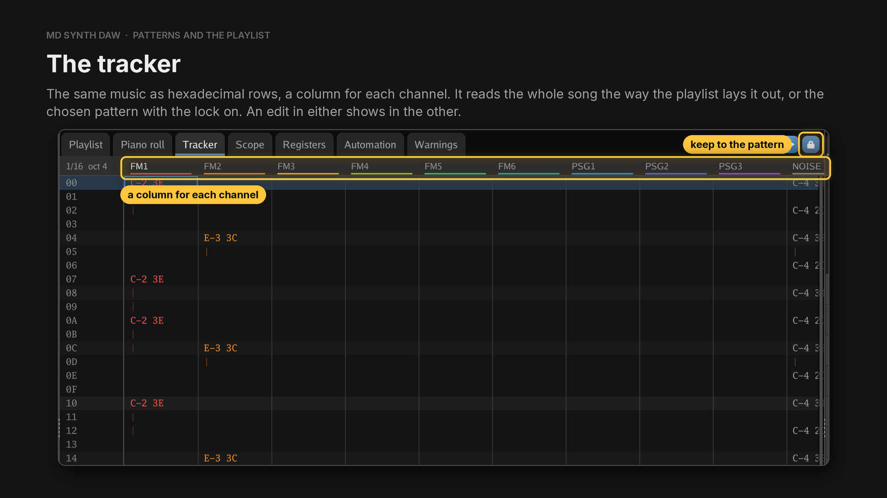

The **Tracker** shows the same music as hexadecimal rows, a column for each channel. It reads the
whole song the way the playlist lays it out, or the chosen pattern with the lock on, and an edit in
either shows in the other. `Ctrl+Page Up` and `Ctrl+Page Down` pick the octave typed notes land in,
`Ctrl+Left` and `Ctrl+Right` give fewer or more rows a beat, `Ctrl+Up` and `Ctrl+Down` change the
velocity at the cursor, and `1` writes a note cut.

(<a href="#top">back to top</a>)

---

## 13. The FM synthesizer

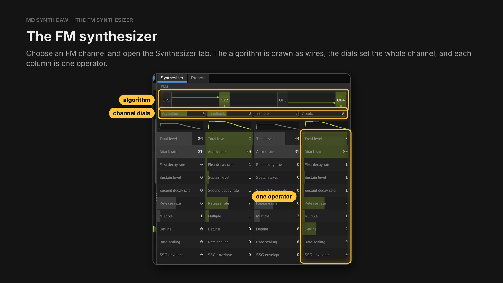

Choose an FM channel and open the **Synthesizer** tab. The **algorithm** is drawn as wires, so which
operator modulates which can be seen. The dials above set the whole channel: **Algorithm**,
**Feedback**, and **Tremolo** and **Vibrato**, how deeply the channel follows the chip's one LFO.
Each column below is one operator, with its envelope drawn above it. Widen the instrument panel and
the parameters spell out their names; narrow, they use the register names.

How operators, envelopes and algorithms work is in
[FM channels, operators and algorithms](#2-fm-channels-operators-and-algorithms).

| Parameter | Range | What it does |
| --- | --- | --- |
| Total level (TL) | 0 to 127 | how loud the operator is, 0.75 dB a step, higher is quieter |
| Attack rate (AR) | 0 to 31 | how fast it rises after the key on |
| First decay rate (D1R) | 0 to 31 | how fast it falls to the sustain level |
| Sustain level (D1L) | 0 to 15 | where the first decay stops, higher is quieter |
| Second decay rate (D2R) | 0 to 31 | how fast it keeps falling while the key is held, 0 holds |
| Release rate (RR) | 0 to 15 | how fast it fades after the key off |
| Multiple | 0 to 15 | its pitch as a multiple of the note, 0 is a half |
| Detune | 0 to 7 | a small shift away from that multiple |
| Rate scaling (RS) | 0 to 3 | how much faster the envelope runs on high notes |
| SSG envelope | 0 to 15 | from 8 up, repeats, holds or mirrors the envelope |

A higher rate is faster. Every parameter is a bar you drag, and it follows the pointer. A click
selects it without changing it, a double click puts it back where a fresh preset has it, and the
wheel steps by four, or by one with `Ctrl` held. `Ctrl` while dragging makes any drag fine. Right
click a single dial to put just that parameter back to the preset.

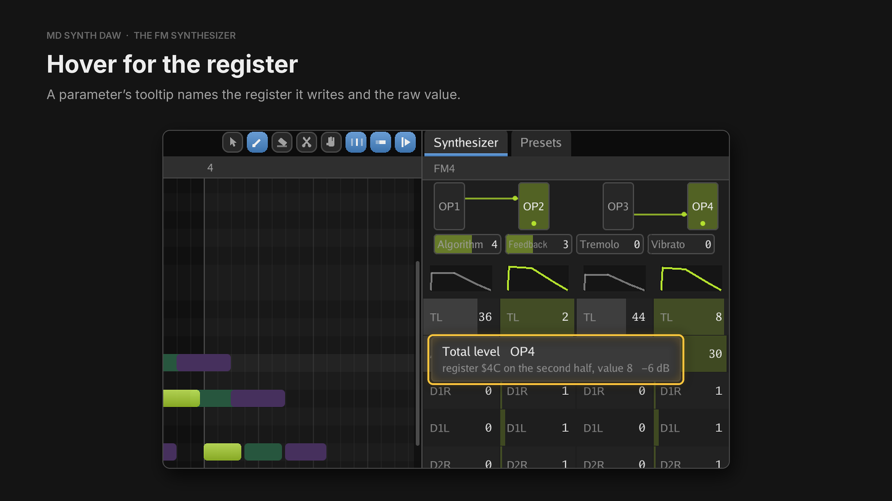

**Hover a parameter** and its tooltip names the register it writes and the raw value.

### Speed for the song, depth for the channel

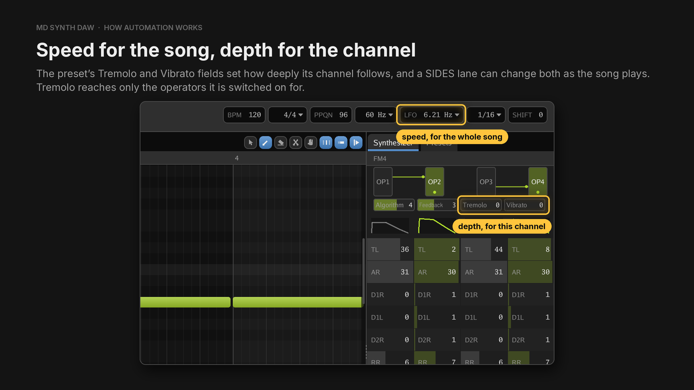

Each channel only chooses how deeply it follows: the preset's **Vibrato** field, 0 to 7, and its
**Tremolo** field, 0 to 3. A `SIDES` lane can change both while the song plays. Tremolo reaches only
the operators it is switched on for, which is the 128 in an `AM D1R` value. For a speed of its own
on each channel, draw the vibrato or the tremolo on a lane instead: see
[Vibrato and tremolo](#24-vibrato-and-tremolo).

(<a href="#top">back to top</a>)

---

## 14. Squares and noise

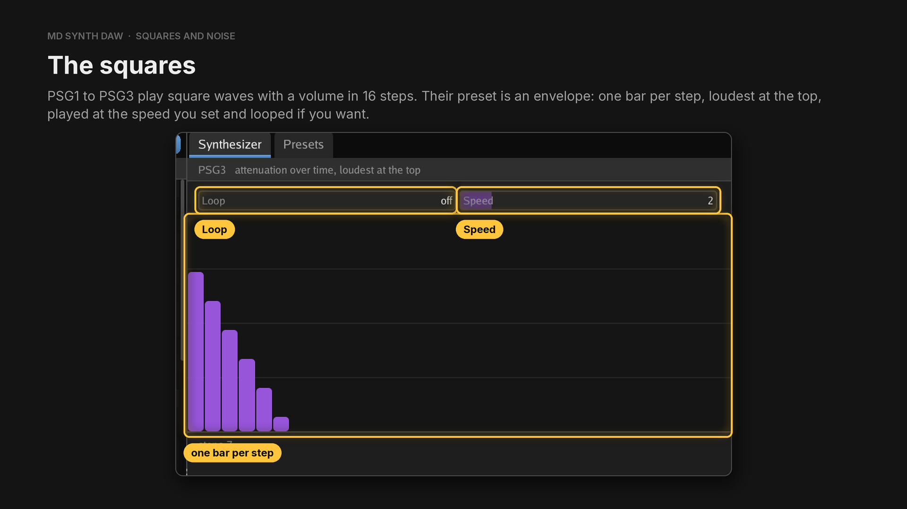

Choose **PSG1**, **PSG2** or **PSG3** and open the **Synthesizer** tab. A square's preset is an
**envelope**: one bar per step of volume, loudest at the top, played at the **Speed** you set and
repeated if **Loop** is on.

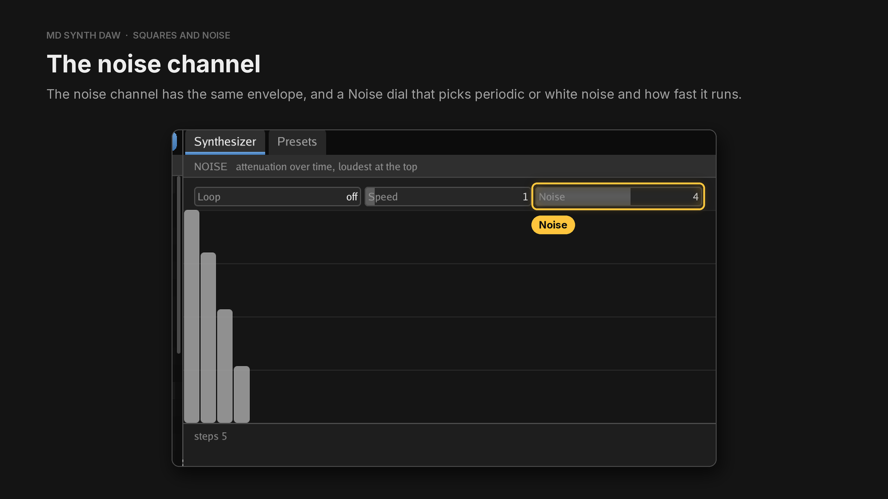

The **noise channel** has the same envelope, and a **Noise** dial that picks the kind of noise and
its rate, as [The squares and the noise channel](#5-the-squares-and-the-noise-channel) lists. On 3 or
7, notes written on NOISE play at their own pitch: see [Pitched noise](#pitched-noise).

(<a href="#top">back to top</a>)

---

## 15. Samples and drum kits

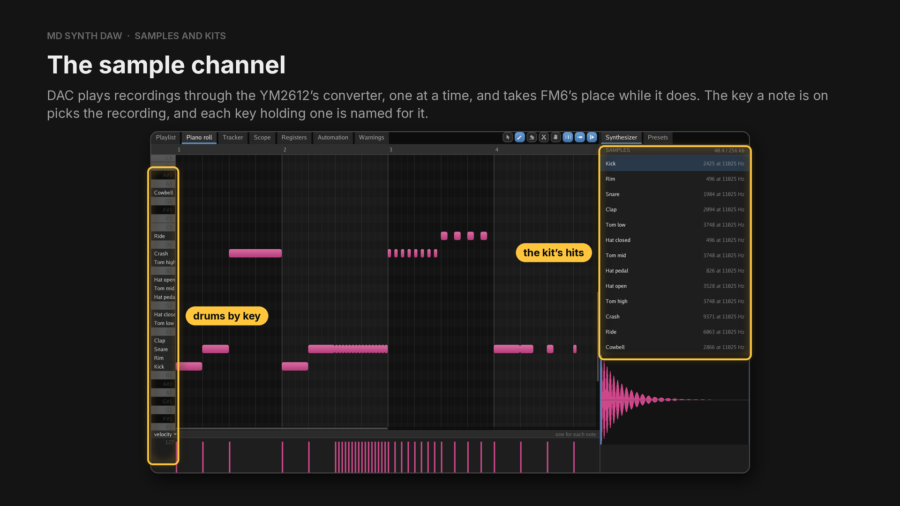

The **DAC** channel plays recordings, and the key a note is on picks which: each recording sits on a
key of its own, and the piano roll names the keys that hold one. Seven kits ship, named for the music
they suit: 808, Ambient, Pop, Trap, Dubstep, Gabber and Hardcore, plus a kit of thirteen synthesised
hits.

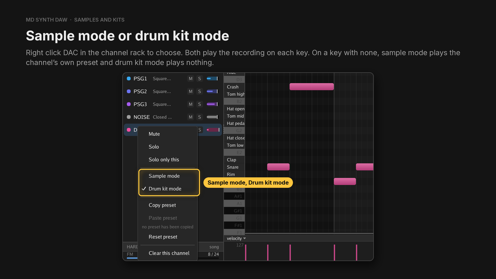

Right click **DAC** in the channel rack to choose **Sample mode** or **Drum kit mode**. They differ
only on a key with no recording on it. Sample mode plays the channel's own preset there, so a song
written for one recording keeps sounding, and drum kit mode plays nothing, the way a General MIDI
drum kit leaves its empty keys silent. A MIDI drum track arrives in drum kit mode.

- **Import**, **Import a WAV as a sample** brings a recording in. Drag across its waveform to mark
  the part to keep, then choose **Trim** from the right-click menu.
- **Import**, **Make a kit** gathers WAVs from anywhere, a file or a folder at a time, and **Detect
  keys** puts every hit on a key: from a note in its file name where there is one, and otherwise
  from what the recording sounds like.
- A General MIDI drum track lands on the right hits, because the shipped samples sit on their
  General MIDI notes.

(<a href="#top">back to top</a>)

---

## 16. Presets

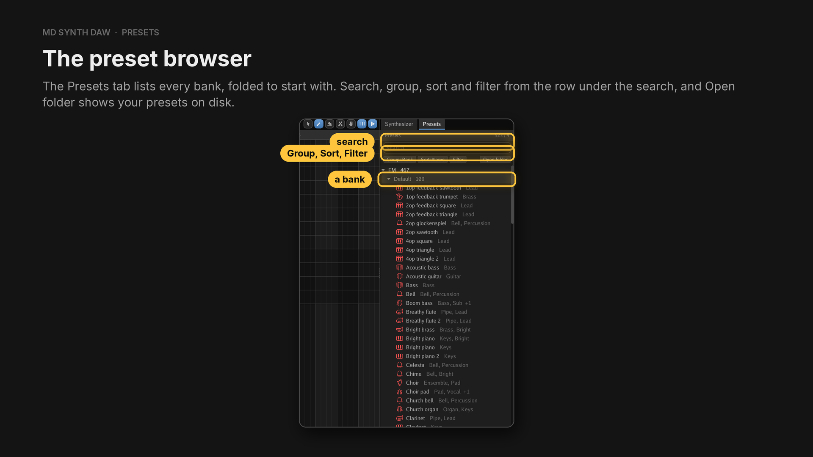

The **Presets** tab lists every bank, folded to start with. **Group**, **Sort** and **Filter** sit
under the search, and **Open folder** shows your presets on disk. **Sort**, **Similar** puts the
presets closest to what the chosen channel plays first, with how alike each one is as a percentage.

Search by name or tag, or with words that narrow it:

| Type | To keep |
| --- | --- |
| `tag:bass` | presets with a tag holding bass |
| `bank:sonic` | banks whose name holds sonic |
| `-word` | everything the word does not match |
| `"a phrase"` | the phrase taken whole |
| `fav` | your favourites |
| `used` | what the open piece plays |

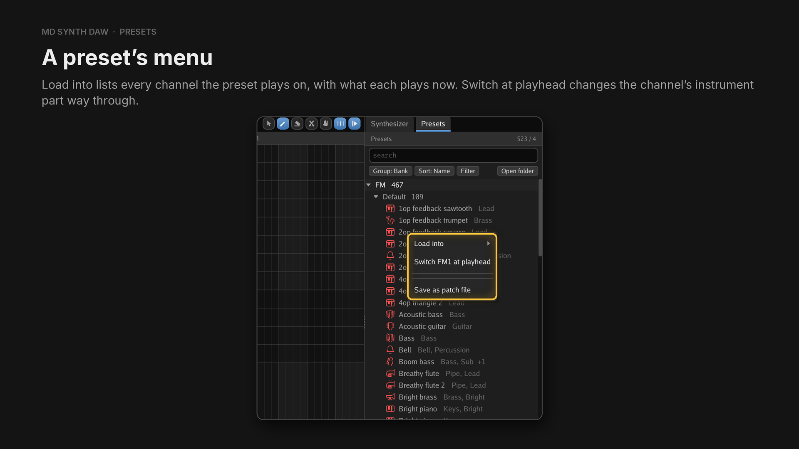

**Right click a preset**: **Load into** lists every channel it plays on, with what each plays now,
and **Switch at playhead** changes a channel's instrument part way through a pattern. Your own
presets also rename, retag, move, copy and delete from here.

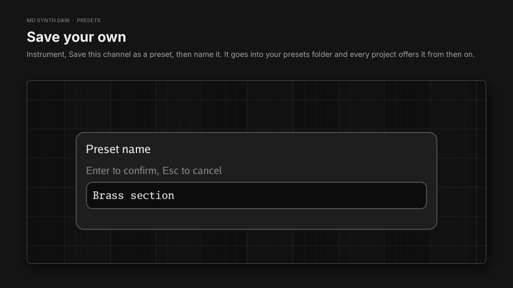

**Instrument**, **Save this channel as a preset** asks for a name and writes it into your presets
folder, and every project offers it from then on.

- **Default** is built in: 140 presets, 67 of the FM presets by ulalume under CC0.
- Four game banks ship, read out of Sonic the Hedgehog 1, 2 and 3 and Mickey Mania: 374 presets,
  each tagged with the tracks it came from.
- Loading a preset gives the channel its own copy. Tweak freely: choosing the same preset again puts
  every field back in one undo step.
- A saved project holds only the presets it plays, so it opens the same on any machine.
- A preset writes out as `.mdpreset` and a bank as `.mdbank`, to hand to anybody.

(<a href="#top">back to top</a>)

---

## 17. Automation

Almost any change of sound can be drawn as automation. Each lane writes one register of the chosen
channel, and the app plays it back the way a sound driver would: it works a lane's value out once a
frame and writes it only where it changed. See
[How a song reaches the chips](#7-how-a-song-reaches-the-chips).

### A lane is a register

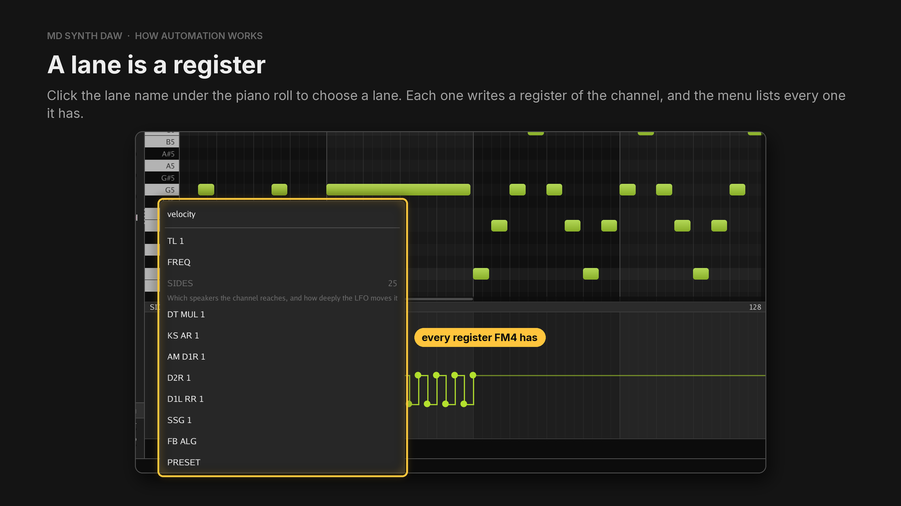

Click the lane name under the piano roll to choose which lane it shows. The **Automation** tab shows
every lane of the chosen channel at once.

| Channel | Lanes |
| --- | --- |
| FM | `TL 1` to `TL 4`, `FREQ`, `SIDES`, `DT MUL 1` to `4`, `KS AR`, `AM D1R`, `D2R`, `D1L RR`, `SSG`, `FB ALG`, `PRESET` |
| Squares | `LEVEL`, `PERIOD`, `PRESET` |
| Noise | `LEVEL`, `NOISE`, `PRESET` |

### Every point has a shape

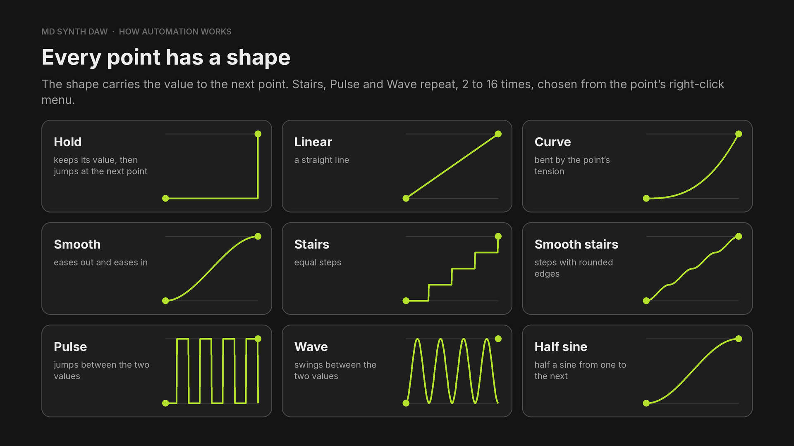

A point's shape says how the value travels to the next point: Hold, Linear, Curve, Smooth, Stairs,
Smooth stairs, Pulse, Wave or Half sine. Stairs, Pulse and Wave repeat, and you choose how many
times (2, 3, 4, 6, 8, 12 or 16) from the point's right-click menu.

**A Wave or Pulse point swings between its own value and the next point's value.** So a vibrato is
one Wave point at the bottom of the swing and one point after it at the top.

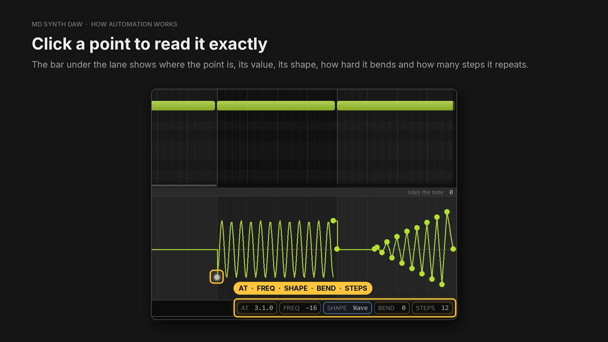

Click a point and the bar under the lane shows it exactly: **AT**, where it sits in bars, beats and
ticks, its value, its **SHAPE**, how hard it **BEND**s and how many **STEPS** it repeats. A beat
is 96 ticks and a bar is 384.

### A lane holds its value

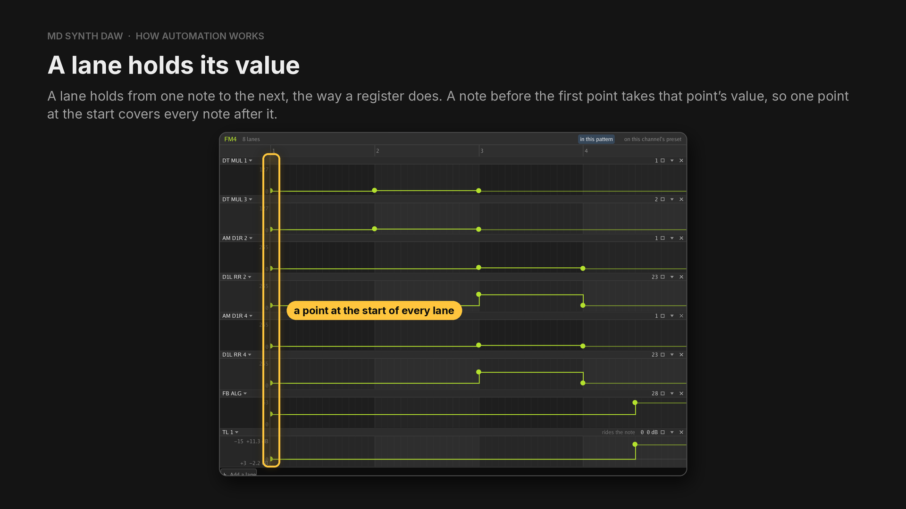

A lane holds its value from one note to the next, the way a register does on the chip. A note
before a lane's first point takes that first point's value. Put a point at the start of the pattern
holding the normal value, and one point is enough for every note after it.

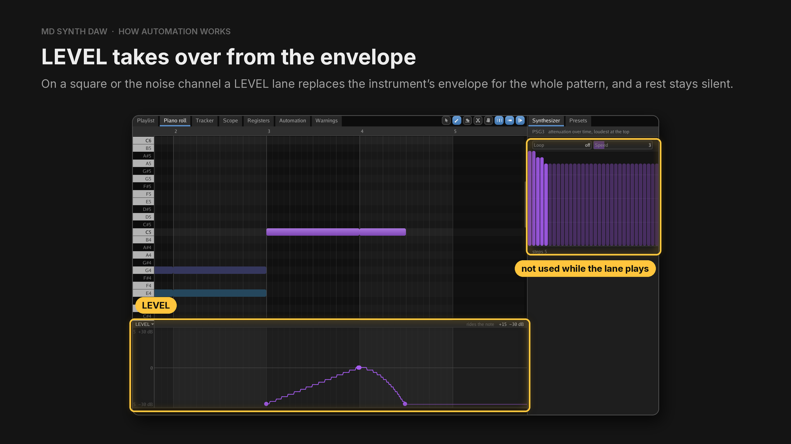

**A LEVEL lane replaces the envelope.** On a square or the noise channel, a `LEVEL` lane takes the
place of the instrument's envelope for that channel in the whole pattern, and a rest stays silent.

(<a href="#top">back to top</a>)

---

## 18. Watching the console hardware

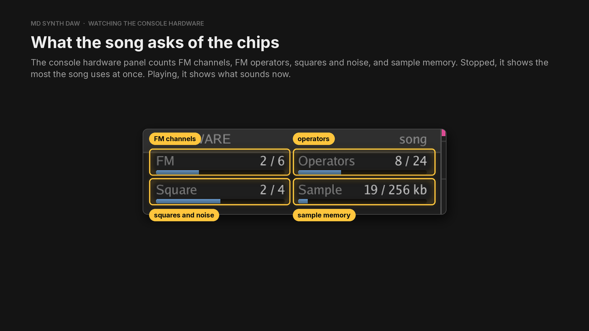

The **console hardware** panel counts what the song asks of the chips: FM channels, FM operators,
squares and noise, and sample memory. Stopped, it reads **song** and shows the most sounding at once
anywhere in the song. Playing, it reads **now** and shows what sounds right then. Sample memory is a
total, because that is what a cartridge holds. The budget starts at a quarter of a one megabyte
cartridge, which is a convention, and you can set your own.

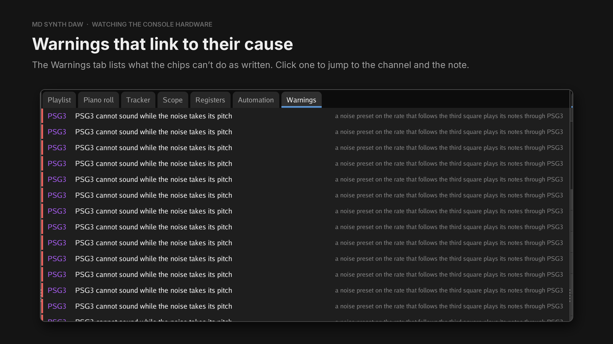

The **Warnings** tab lists what the chips can't do as written. Click a warning to jump to the channel
and the note.

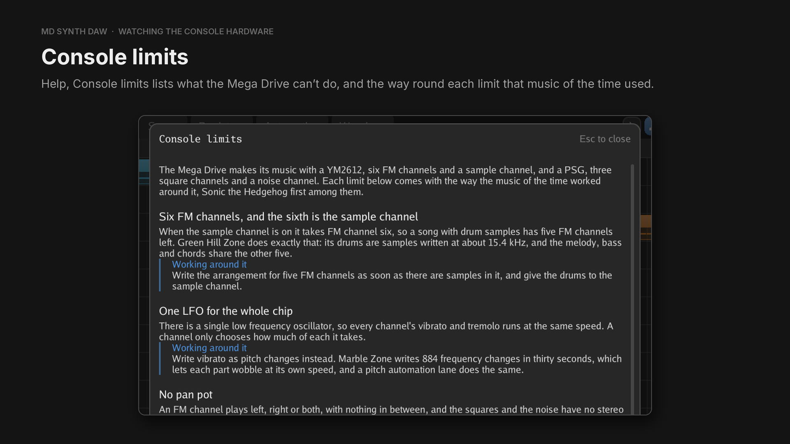

**Help**, **Console limits** lists what the Mega Drive can't do, and the way round each limit that
music of the time used. [Part 3](#part-3-advanced-usage) goes through them.

The **Scope** tab draws every channel's wave, and a right click sets **Waveform** or **Spectrum**,
the speed and the accuracy. The **Registers** tab logs which chip took each write, and when.
**View**, **Play through a driver** holds every frame to the register writes a driver on the console
could make, about 178 at 60 Hz, so a part asking for too much is heard arriving late.

(<a href="#top">back to top</a>)

---

## 19. Importing and exporting

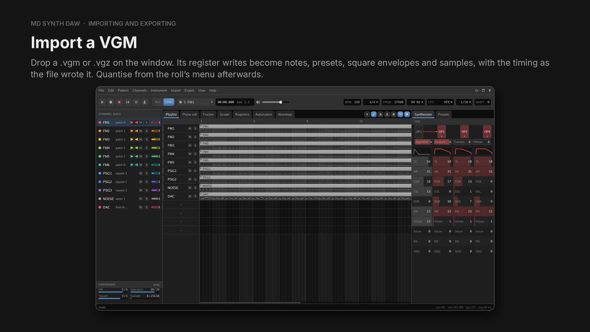

**Drop a `.vgm` or `.vgz` on the window**, or use the **Import** menu. Its register writes become
notes, presets, square envelopes and samples. The timing stays as the file wrote it, and the exact
frequency is kept at every key on, so vibrato and slides come across. Right click in the roll,
**Quantise**, to put the notes on the grid.

| File | What comes across |
| --- | --- |
| VGM and VGZ | notes, presets, square envelopes and samples |
| XGM | patterns and samples |
| MIDI | notes and tempo, choosing which tracks to take and which part each plays |
| WAV | a recording for the sample channel |
| TFI | one FM preset |
| `.mdpreset`, `.mdbank` | a preset or a bank, with its recordings |

A MIDI file can become a piece of its own, or one more track in the piece you have open.

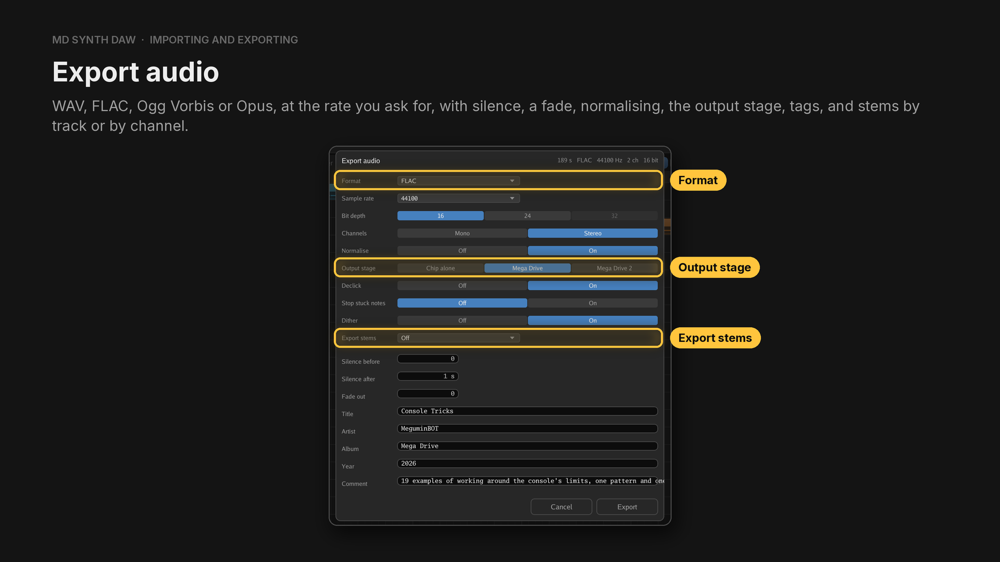

**Export**, **Export audio** writes WAV, FLAC, Ogg Vorbis or Opus at the rate you ask for, with
silence before and after, a fade, normalising to a ceiling, dither, the output stage, tags, and
**stems** by track or by channel. Stems take the gain the mix worked out, so the set sums back to
the mix. Normalising is by peak; nothing here measures LUFS. There is no MP3 export, because every
good MP3 encoder is LGPL, while Ogg Vorbis and Opus carry no such condition.

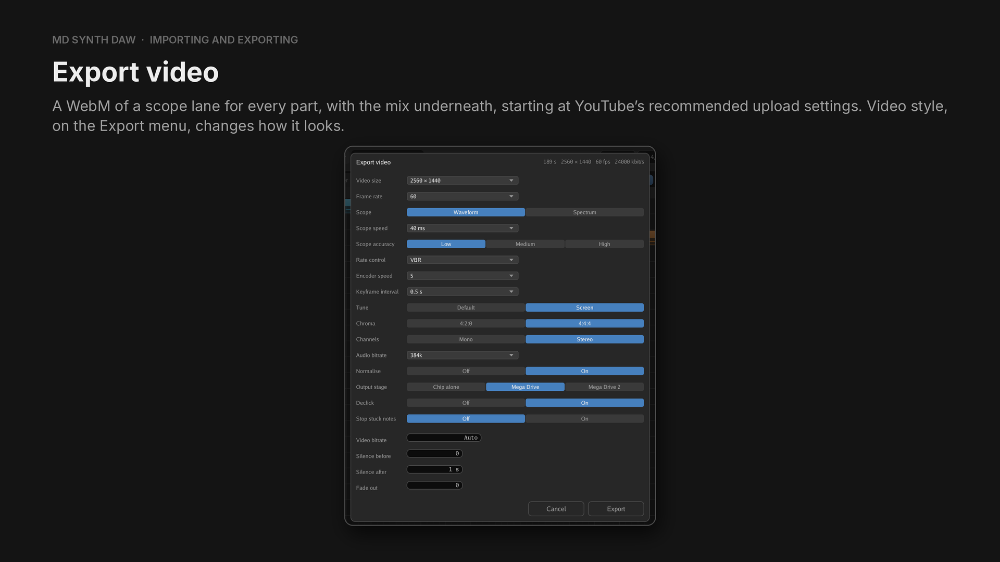

**Export**, **Export video** writes a WebM of a scope lane for every part the song uses, with the mix
underneath as Opus audio, starting at YouTube's recommended upload settings. **Export**, **Video
style** opens a window of its own for how it looks: colours, backgrounds, pictures, text and effects.

| Export | What it is for |
| --- | --- |
| Audio | WAV, FLAC, Ogg Vorbis or Opus, with stems if you want them |
| Video | a WebM of scope lanes with the mix, ready for YouTube |
| VGM | the register writes, for any VGM player |
| XGM | the format SGDK's driver plays |
| MIDI | the notes, for any other program |
| TFI | one FM preset |

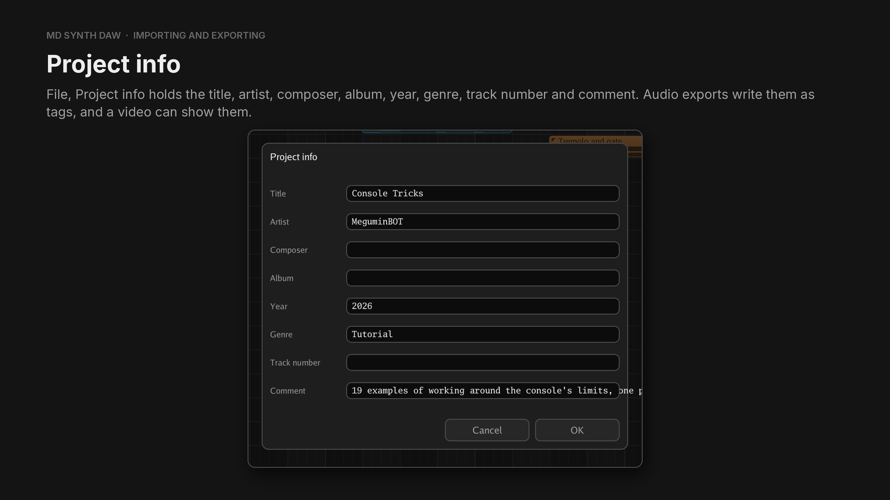

**File**, **Project info** holds the title, artist, composer, album, year, genre, track number and
comment. Audio exports write them as tags, and a video's text can show them.

(<a href="#top">back to top</a>)

---

## 20. Preferences

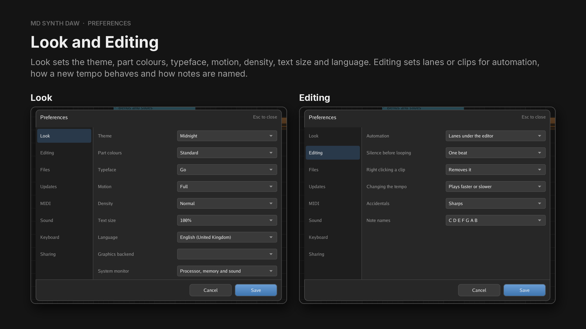

`Ctrl+,` opens the preferences. Every setting says what it does when you hover it, and nothing
changes until you save.

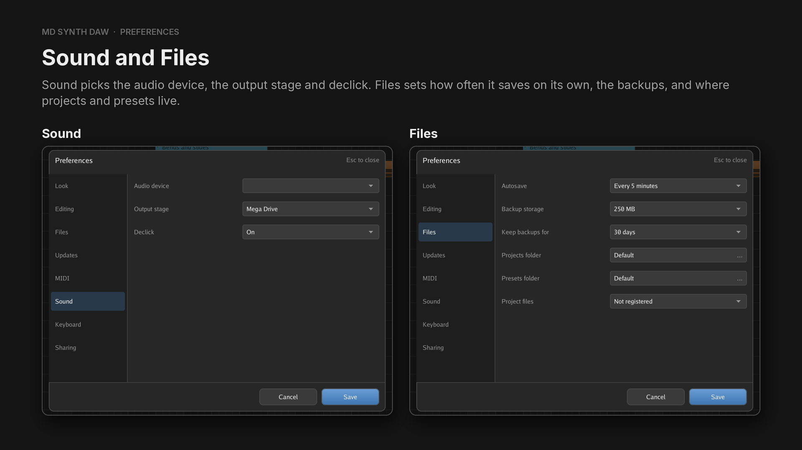

| Group | What it holds |
| --- | --- |
| Look | theme, part colours, typeface, motion, density, text size, language, graphics backend, system monitor |
| Editing | lanes or clips for automation, silence before looping, right clicking a clip, changing the tempo, note names |
| Files | autosave, backups, projects folder, presets folder, project files |
| Updates | whether to look for a newer version at launch |
| MIDI | keyboard, channel, velocity, pitch bend range, eight controller slots |
| Sound | audio device, output stage, declick |
| Keyboard | every shortcut |
| Sharing | what Discord shows |

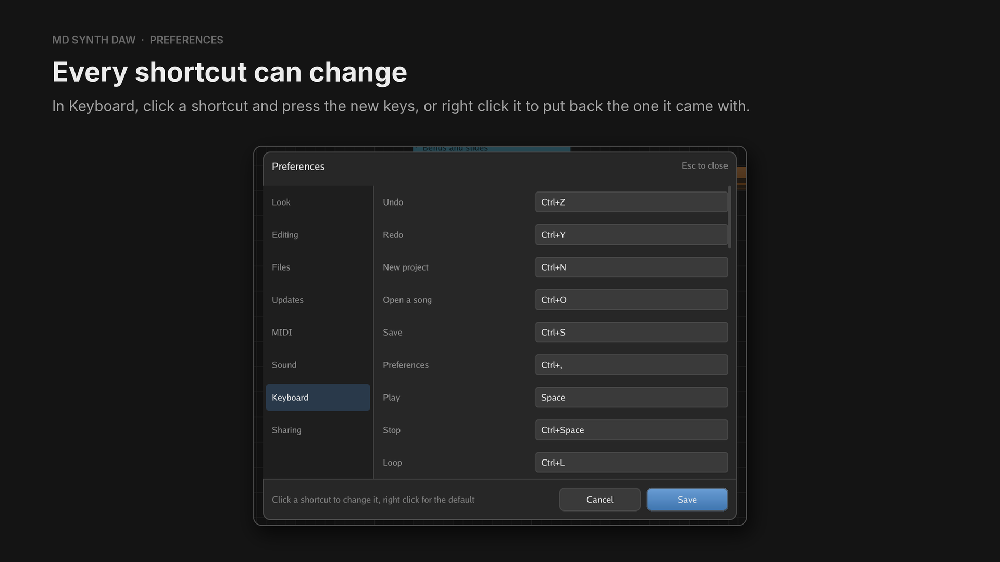

**Every shortcut can change.** In **Keyboard**, click one and press the new keys, or right click it
to put back the one it came with.

(<a href="#top">back to top</a>)

---

# Part 3: Advanced usage

Advanced automation, and the techniques that get a song past what the hardware can't do on its own.

Every technique has an example in **Console Tricks**, a project of 19 short examples in the MD Synth
DAW repository at [`assets/example-projects/console-tricks.mdsyn`](../assets/example-projects/console-tricks.mdsyn). Each example is one track holding
one four bar pattern, and most of them play the plain way first and the technique after it. The
**Hear it** links play each example on its own.

---

## 21. Advanced automation

### Some lanes hold two settings

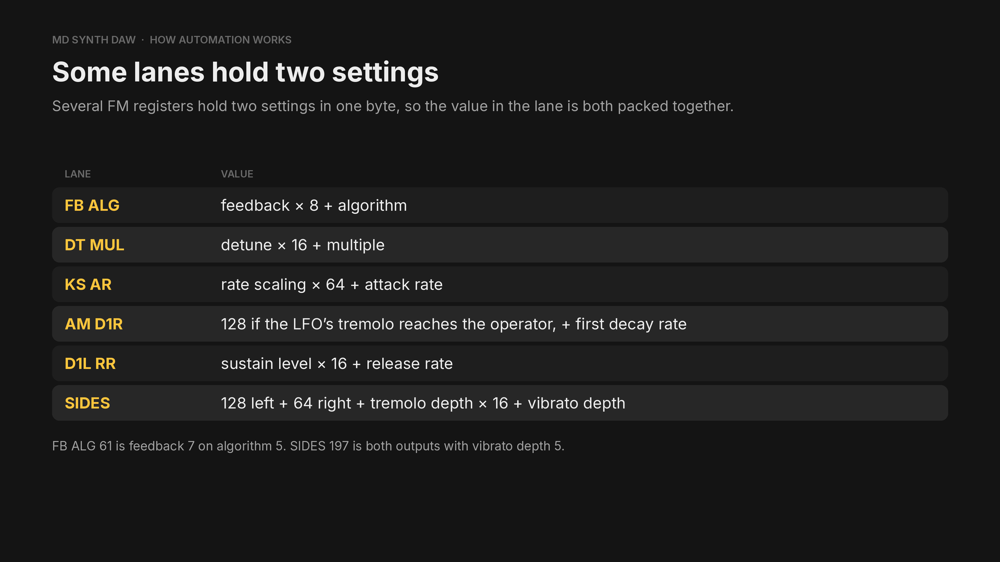

Several FM registers hold two settings in one byte, so the value you enter is both packed together.

| Lane | Value |
| --- | --- |
| `FB ALG` | feedback × 8 + algorithm |
| `DT MUL` | detune × 16 + multiple |
| `KS AR` | rate scaling × 64 + attack rate |
| `AM D1R` | 128 if the LFO's tremolo reaches the operator, + first decay rate |
| `D1L RR` | sustain level × 16 + release rate |
| `SIDES` | 128 for left + 64 for right + tremolo depth × 16 + vibrato depth |

So `FB ALG` 61 is feedback 7 on algorithm 5, and `SIDES` 197 is both outputs with vibrato depth 5.

### Two kinds of lane

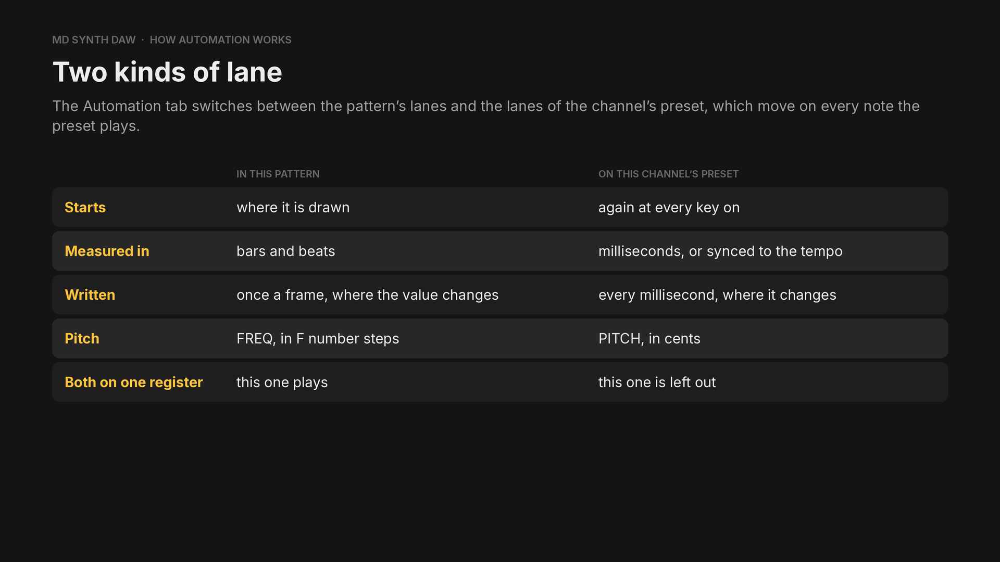

The Automation tab switches between **in this pattern** and **on this channel's preset**, at the
right of its header. A pattern's lanes play where they're drawn. A preset's lanes start again at
every note the preset plays, the way a synthesizer's envelopes and LFOs do.

| | In this pattern | On this channel's preset |
| --- | --- | --- |
| Starts | where it's drawn | again at every key on |
| Measured in | bars and beats | milliseconds, or synced to the tempo |
| Written | once a frame, where the value changes | every millisecond, where the value changes |
| Pitch | `FREQ`, in F number steps | `PITCH`, in cents |
| Both on one register | this one plays | this one is left out |

A lane's menu also offers **Move to the playlist**, which turns it into an automation clip you can
place and reuse on the playlist.

(<a href="#top">back to top</a>)

---

## 22. Pitch bends

**Hear it:** [Bends and slides](examples/02-bends-and-slides.opus)

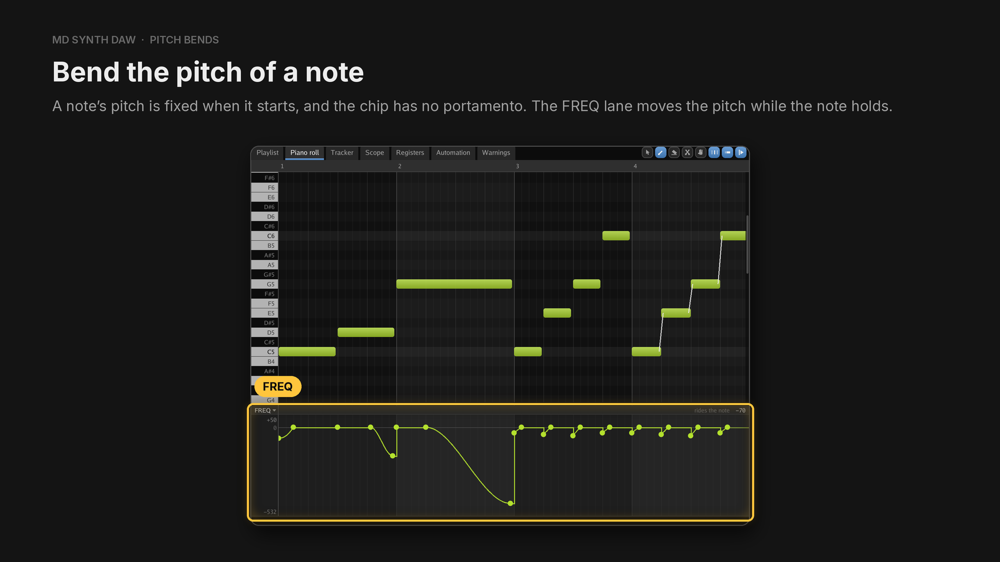

A note's pitch is fixed when it starts, and the chip has no portamento. The `FREQ` lane moves the
pitch while the note holds, and a ramp between two values bends it.

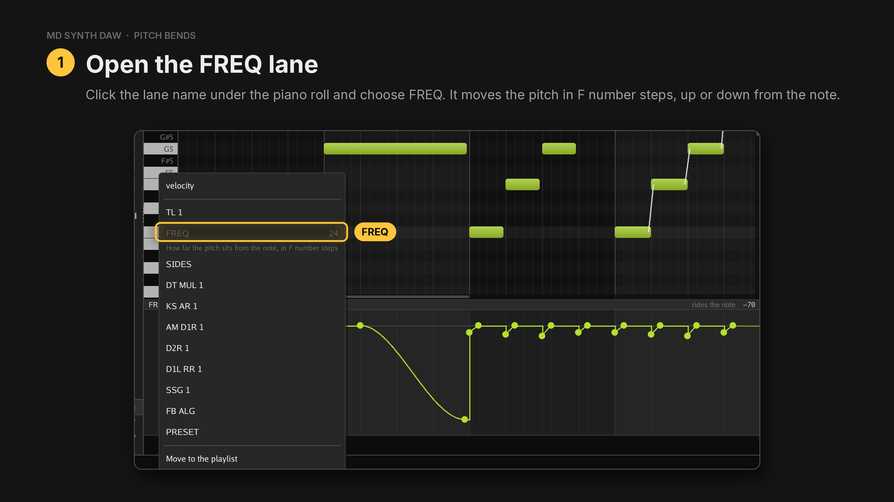

Click the lane name under the piano roll and choose **FREQ**. It moves an FM note in F number steps,
up or down from the note.

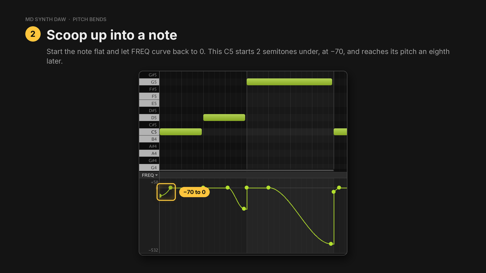

**A scoop** starts the note flat and curves back to 0. In the example, C5 starts 2 semitones under,
at −70, and reaches its pitch an eighth later.

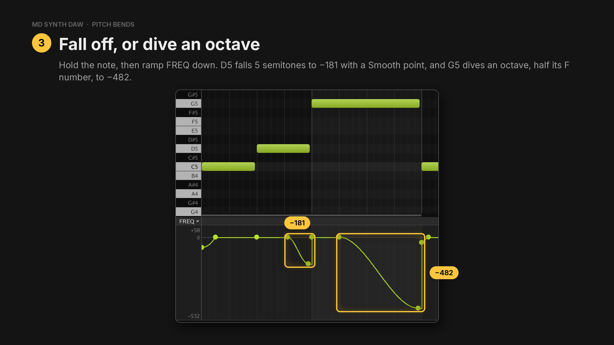

**A fall or a dive** holds the note, then ramps away from 0. D5 holds until tick 300 and falls 5
semitones to −181 with a Smooth point. G5 holds for a beat, then dives an octave to −482, half its F
number.

### How far is a semitone

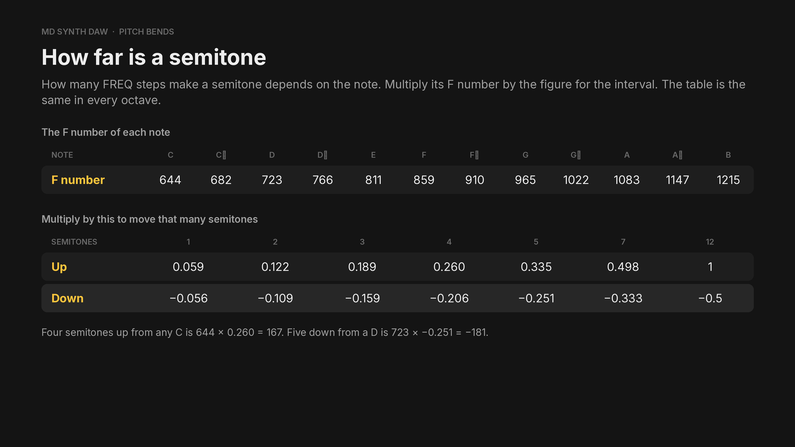

How many `FREQ` steps make a semitone depends on the note. Take the note's F number from the first
table and work out `F × (2^(semitones ÷ 12) − 1)`, or multiply by the figure in the second table.
Both are the same in every octave.

An octave down is minus half the F number, and an octave up is plus the whole of it. Four semitones
up from any C is 644 × 0.260 = 167. See [Quick reference](#33-quick-reference) for both tables.

**In the example** (FM4, preset *Brass*):

- **Bar 1:** C5 scoops up from −70, then D5 falls off to −181.
- **Bar 2:** G5 holds for a beat, then dives an octave to −482.
- **Bar 3:** C5, E5, G5 and C6 as four notes, each scooped up from a semitone under over a
  sixteenth. Every note is a new key on.
- **Bar 4:** the same four notes, tied. See [Gliding notes](#23-gliding-notes).

(<a href="#top">back to top</a>)

---

## 23. Gliding notes

**Hear it:** bars 3 and 4 of [Bends and slides](examples/02-bends-and-slides.opus)

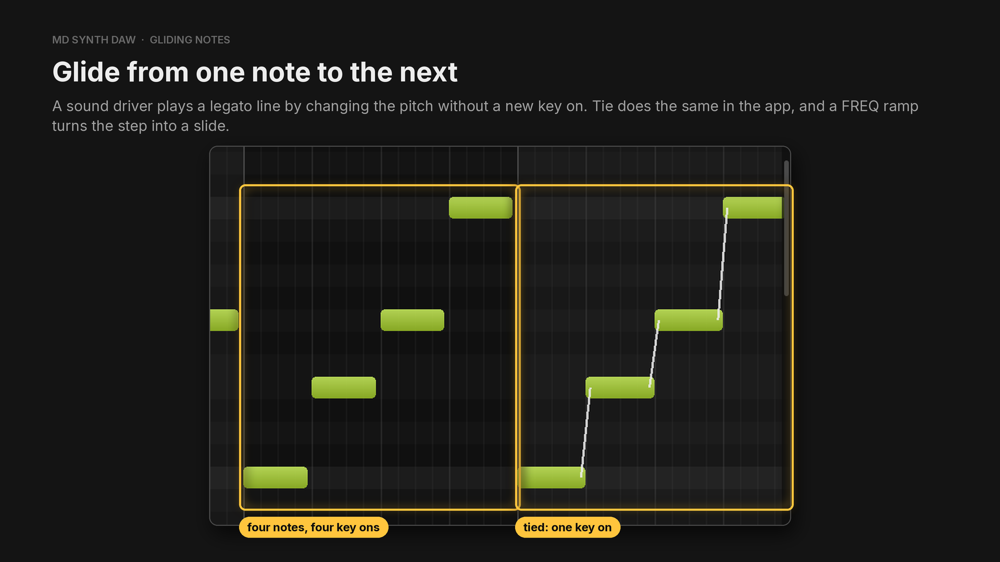

A sound driver plays a legato line by changing the pitch without a new key on. **Tie** does the same
in the app, and a `FREQ` ramp turns the step between two notes into a slide.

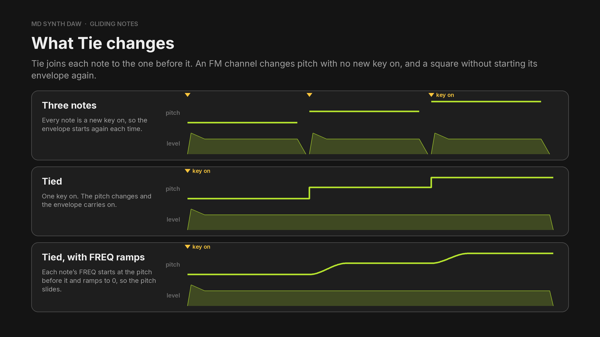

Tie joins each note to the one before it. An FM channel changes pitch with no new key on, and a
square does it without starting its envelope again. The pitch still steps from note to note; the
envelope just carries on. A `FREQ` ramp at the start of each tied note is what makes the pitch
slide.

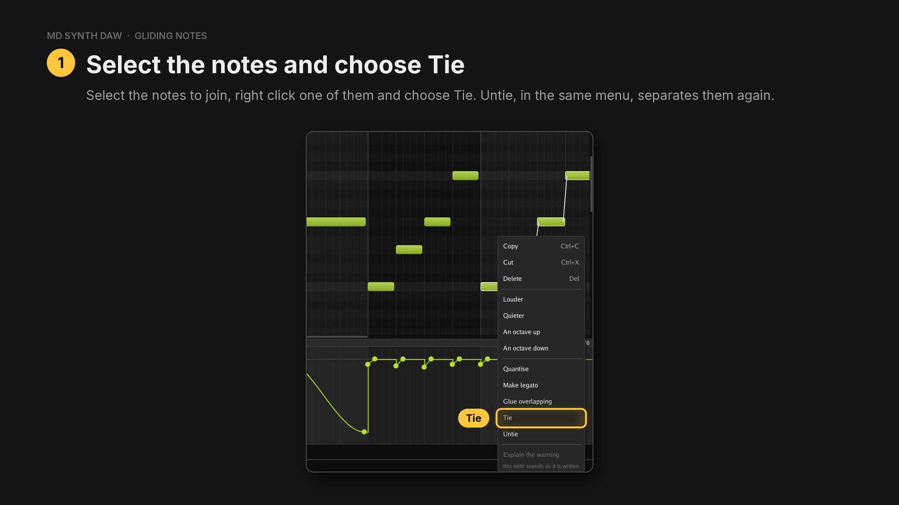

1. **Select the notes** to join, right click one of them and choose **Tie**. **Untie**, in the same
   menu, separates them again.

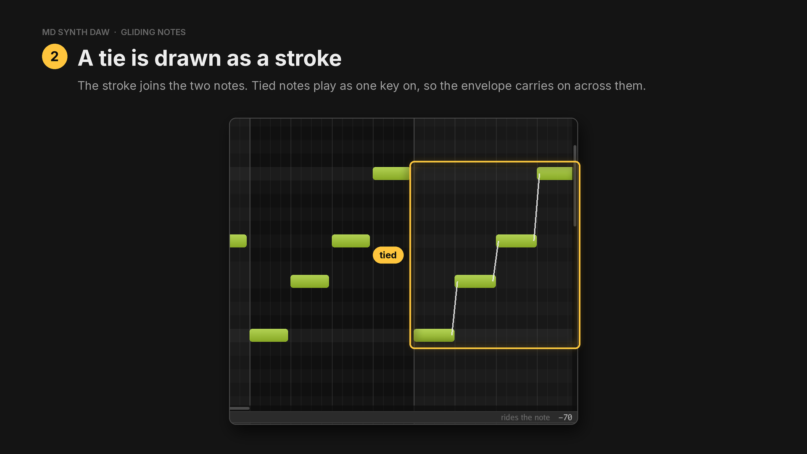

2. **A tie is drawn as a stroke** joining the two notes. Ties read out of an imported file show the
   same way.

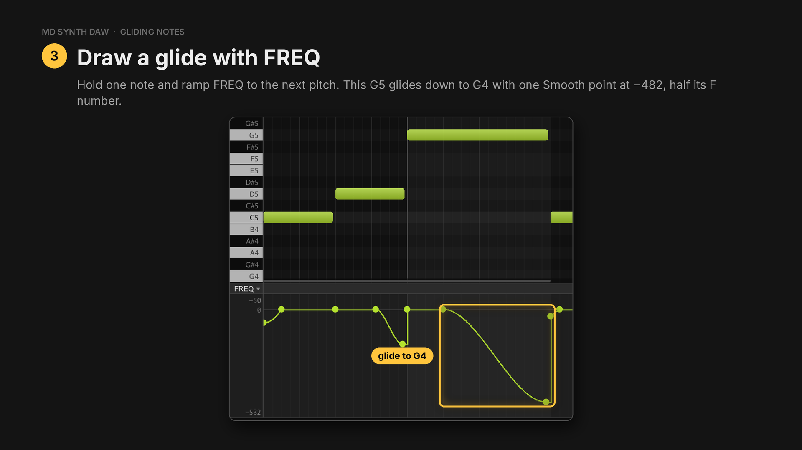

3. **Draw one long glide by hand:** hold a single note and ramp `FREQ` to the pitch you want. This
   G5 glides down to G4 with one Smooth point at −482, half its F number.

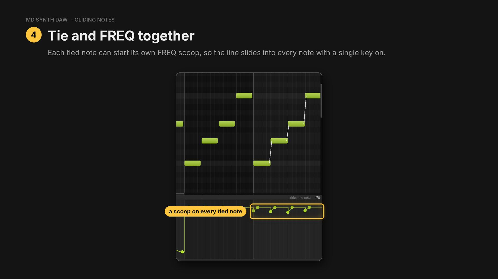

4. **Tie and FREQ together:** each tied note can start its own scoop, so the line slides into every
   note with a single key on.

(<a href="#top">back to top</a>)

---

## 24. Vibrato and tremolo

**Hear it:** [Vibrato](examples/01-vibrato.opus) ·
[Tremolo and gate](examples/03-tremolo-and-gate.opus)

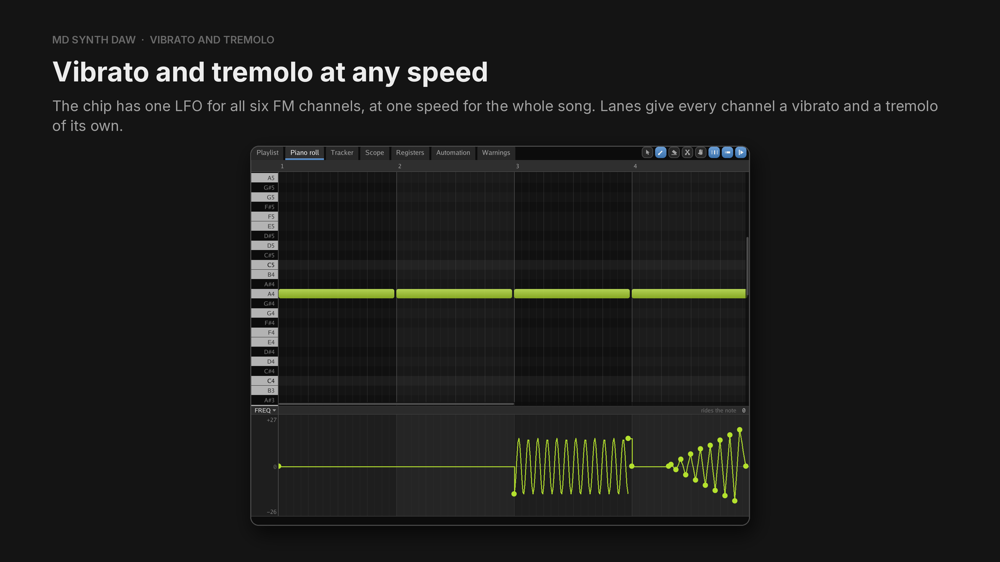

The chip's one LFO wobbles every channel at the same speed, set once for the whole song (see
[One LFO for the whole chip](#3-one-lfo-for-the-whole-chip)). A lane gives every channel a vibrato and
a tremolo of its own, at any speed and depth, and it can start late.

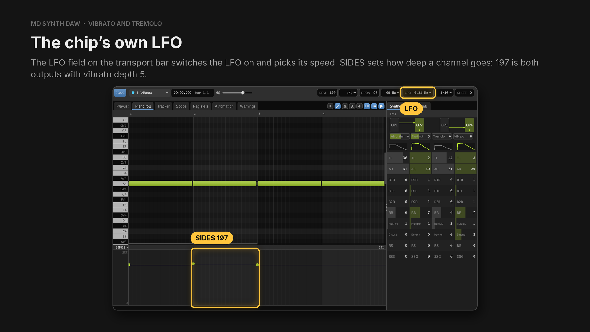

**The chip's own LFO.** The LFO field on the transport bar switches it on and picks its speed.
Console Tricks uses 6.21 Hz. `SIDES` sets how deep a channel goes: 197 is both outputs with vibrato
depth 5, about ±20 cents.

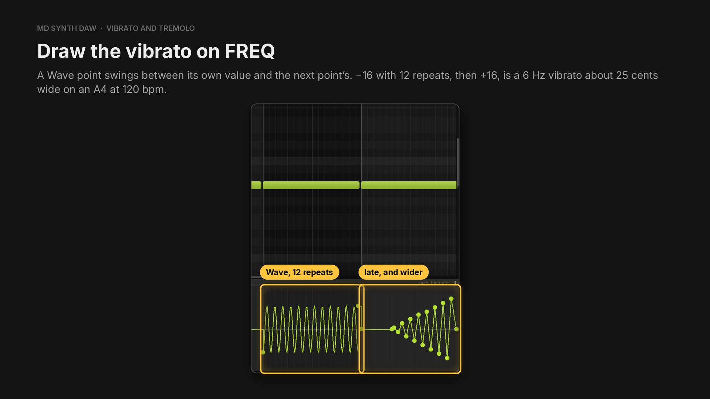

**Draw the vibrato on FREQ.** A Wave point at −16 with 12 repeats, and a point at +16 at the end of
the note, is a 6 Hz vibrato on an A4 at 120 bpm, 16 steps being about 25 cents there. Linear points
that swing a little further out each time make a vibrato that starts late and widens.

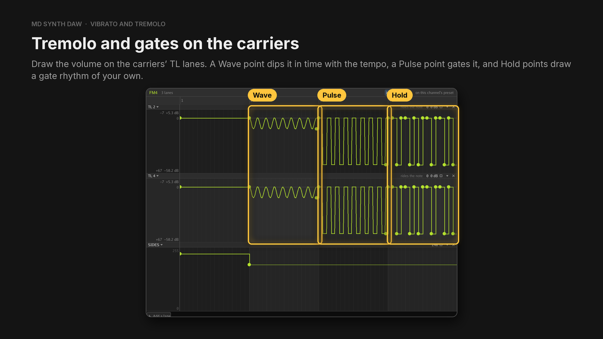

**Tremolo and gates on the carriers.** Draw the volume on the carriers' `TL` lanes. A Wave point
dips it in time with the tempo, a Pulse point gates it on and off, and Hold points draw a gate
rhythm of your own. Put these on the carriers: on a modulator, the same lane changes the tone.

**In the Vibrato example** (FM4, preset *Plain lead*, one A4 per bar):

- **Bar 1:** no vibrato.
- **Bar 2:** the chip's LFO, `SIDES` 197.
- **Bar 3:** `FREQ` with a Wave point at −16, 12 repeats, and +16 at the end of the note.
- **Bar 4:** `FREQ` stays at 0 for the first 120 ticks, then swings six times a beat, a little
  further out each time.

Measured on the render, the pitch doesn't move in bar 1, swings about 31 cents in bar 2 and 43 in
bar 3, and in bar 4 swings 6 cents in the first half and 37 in the second.

**In the Tremolo and gate example** (FM4, preset *Tremolo organ*, algorithm 4, so operators 2 and 4
are the carriers):

- **Bar 1:** the chip's own tremolo, `SIDES` 240, tremolo depth 3, about 12 dB.
- **Bar 2:** `TL 2` and `TL 4` each have a Wave point at 0 with 8 repeats and a point at 14 after it:
  a dip of about 10 dB eight times a bar, locked to the tempo.
- **Bar 3:** a Pulse point between 0 and 60, a gate that opens and closes every sixteenth.
- **Bar 4:** Hold points on every sixteenth, open (0) or shut (60), for a gate rhythm you draw
  yourself.

(<a href="#top">back to top</a>)

---

## 25. Panning

**Hear it:** [Simulated panning](examples/13-simulated-panning.opus) ·
[Unison detune](examples/11-unison-detune.opus)

Headphones help here.

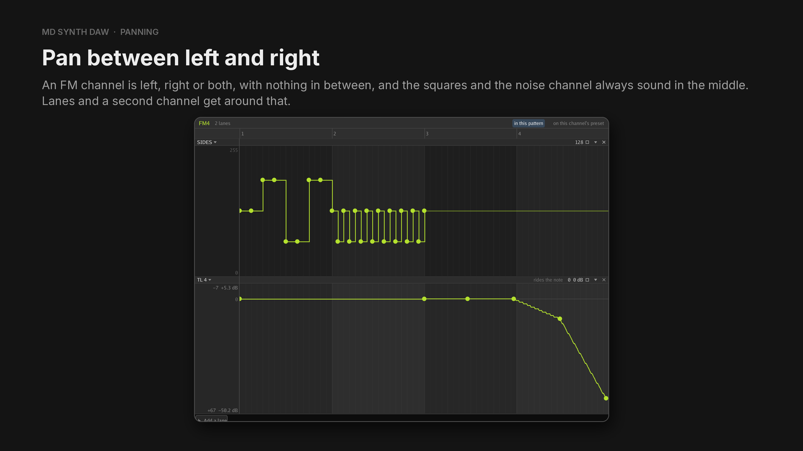

An FM channel sounds left, right or both, with nothing in between. The squares and the noise channel
have no panning at all on the Mega Drive; they always sound in the middle. Lanes and a second
channel get around that.

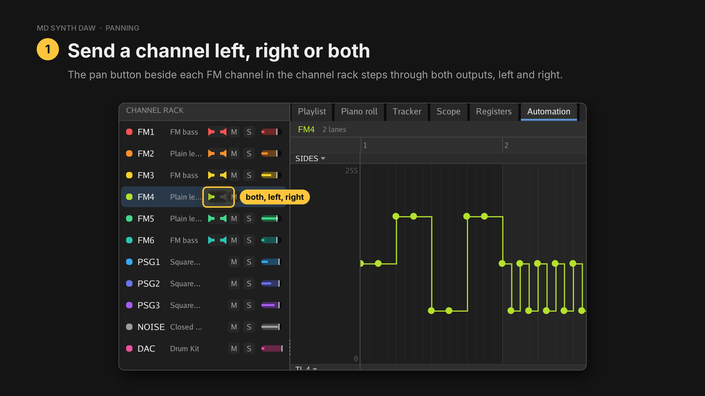

1. **Send a channel left, right or both.** The pan button beside each FM channel in the channel
   rack steps through both outputs, left and right.

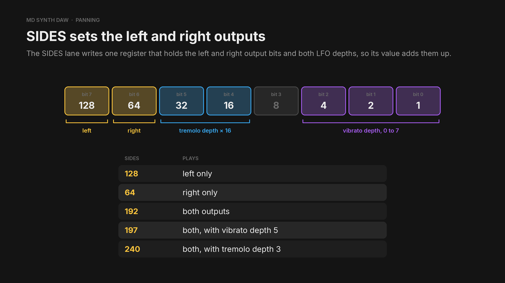

**SIDES sets the left and right outputs.** The `SIDES` lane writes one register holding the left and
right output bits and both LFO depths, so its value adds them up: 128 for left, 64 for right, the
tremolo depth × 16 and the vibrato depth. 192 is both outputs, and a lane on this register owns the
whole byte.

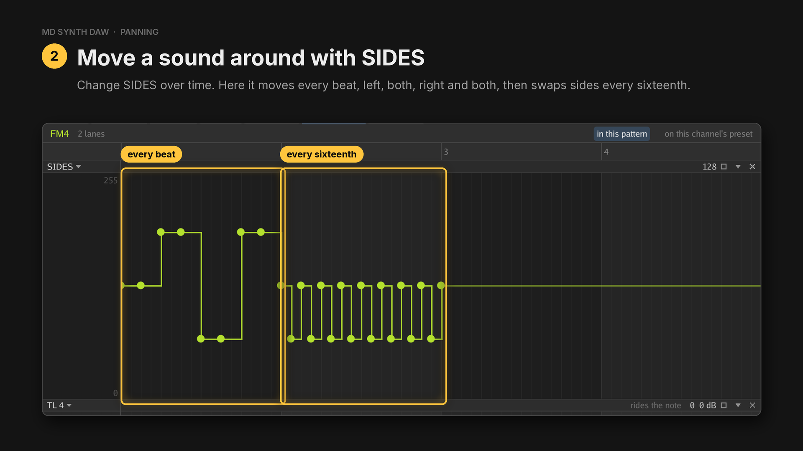

2. **Move a sound around with SIDES.** Change `SIDES` over time: every beat, from left to both to
   right to both, or back and forth every sixteenth.

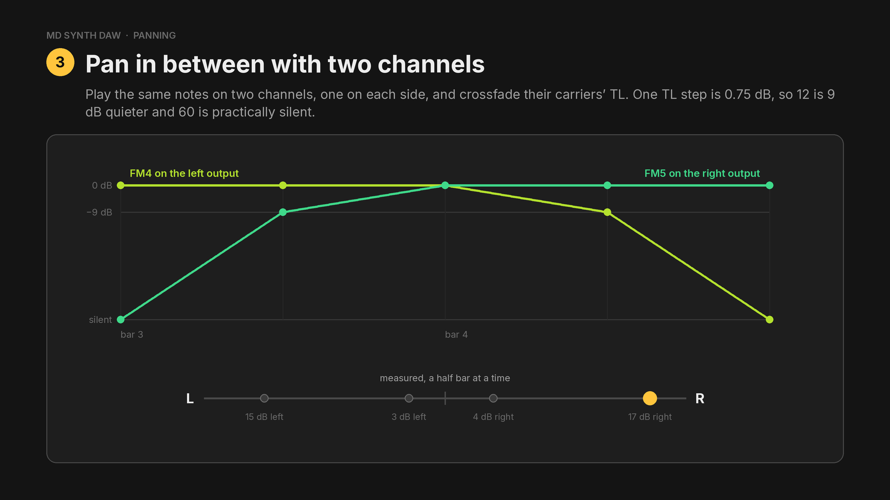

3. **Pan in between with two channels.** Play the same notes on two channels, one on each side, and
   crossfade their carriers' `TL`. One TL step is 0.75 dB, so 12 is 9 dB quieter and 60 is
   practically silent.

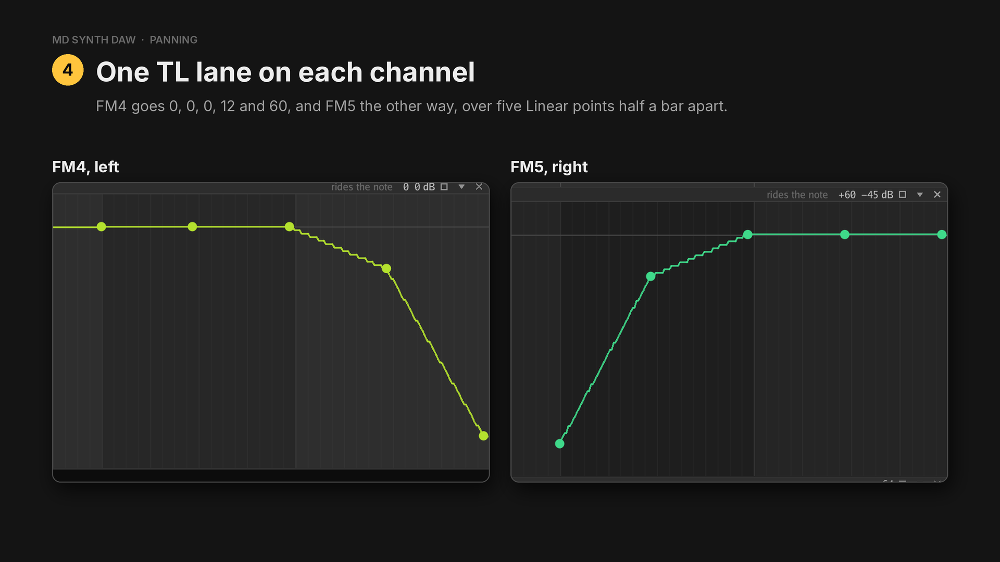

4. **One TL lane on each channel.** FM4 goes 0, 0, 0, 12 and 60, and FM5 the other way, over five
   Linear points about half a bar apart, so the sound travels from the left through the middle to
   the right.

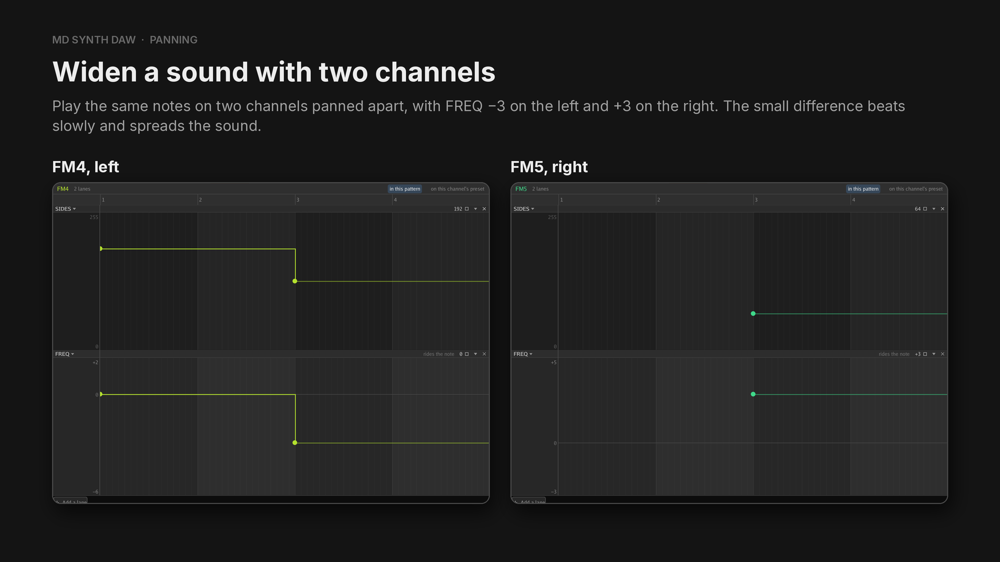

**Widen a sound with two channels.** Play the same notes on two channels panned apart, with `FREQ`
at −3 on the left and +3 on the right. The small difference beats slowly and spreads the sound.

**In the Simulated panning example** (preset *Soft lead*, algorithm 3, so operator 4 is the only
carrier):

- **Bar 1:** `SIDES` changes every beat: 128 (left), 192 (both), 64 (right), 192 (both).
- **Bar 2:** one held note with `SIDES` swapping between left and right every sixteenth.
- **Bars 3 and 4:** the same notes on FM4 (left) and FM5 (right), crossfading on `TL 4`.

Measured, bar 1 is 29 dB left, even, 22 dB right, even. Bars 3 and 4 move 15 dB left, 3 dB left, 4
dB right and 17 dB right. In Unison detune, the left and right outputs have a correlation of 1.0 in
bars 1 and 2, where FM4 plays alone, and 0.08 in bars 3 and 4.

(<a href="#top">back to top</a>)

---

## 26. Filters and distortion

**Hear it:** [Filter sweep](examples/05-filter-sweep.opus) ·
[Distortion](examples/04-distortion.opus)

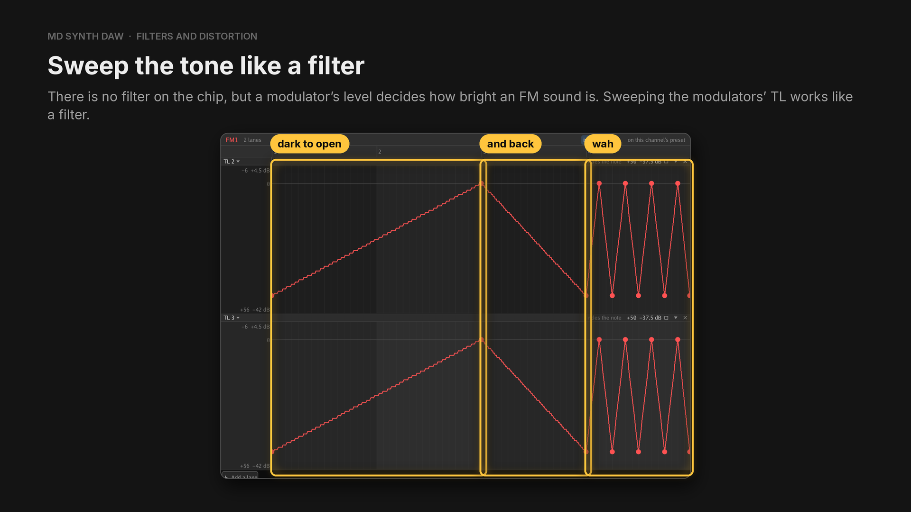

**Sweep the tone like a filter.** There is no filter on the chip, but a modulator's level decides
how bright an FM sound is, so sweeping the modulators' `TL` works like one. In the example (FM1,
preset *Sweep bass*, algorithm 3, where operators 2 and 3 both feed the carrier), `TL 2` and `TL 3`
run Linear from +50 (dark) to 0 (open) across bars 1 and 2, back in bar 3, and make a wah on every
beat in bar 4. The line is sixteenth notes, and each new note starts at the level the lanes hold at
that moment, so the sweep runs smoothly across all of them.

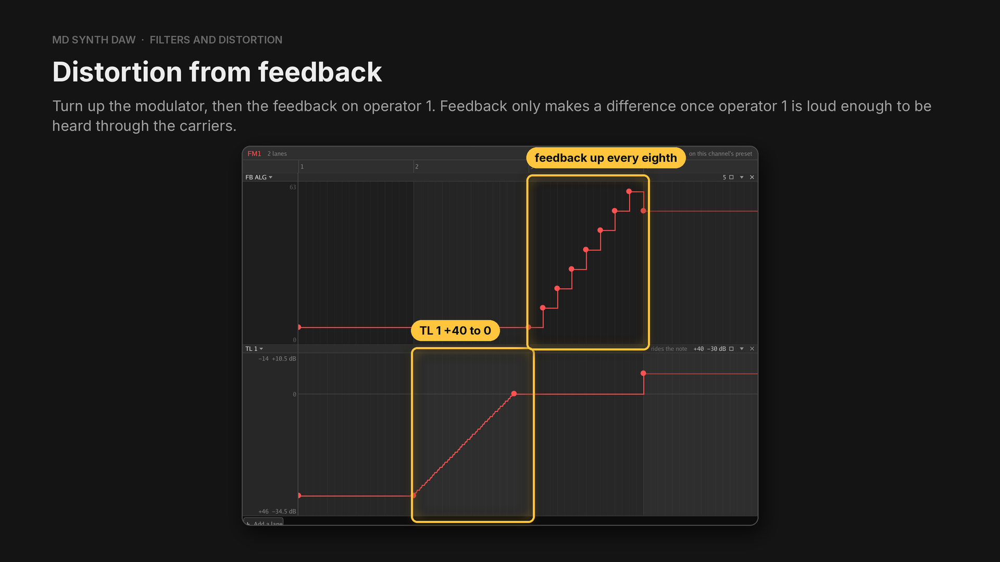

**Distortion from feedback.** There is no distortion effect. What the chip has instead is feedback
on operator 1, and operators that bend each other. The preset *Drive guitar* uses algorithm 5, where
operator 1 feeds carriers on multiples 1, 2 and 3, so one note is already a power chord.

- **Bar 1:** clean. `TL 1` is +40, keeping the modulator 40 steps quieter, and `FB ALG` is 5,
  feedback 0.
- **Bar 2:** `TL 1` runs from +40 down to 0 across the bar. More modulation is more grit.
- **Bar 3:** `FB ALG` climbs one feedback step every eighth: 5, 13, 21, 29, 37, 45, 53 and 61.
  Feedback only makes a difference once operator 1 is loud enough to be heard through the carriers,
  which is why bar 2 turns it up first.
- **Bar 4:** both at once, `FB ALG` 53 (feedback 6) and `TL 1` at −8.

Measured, the energy above 2 kHz goes from 48 dB under the whole sound in bar 1 to about 18 dB under
it in bar 4.

(<a href="#top">back to top</a>)

---

## 27. Changing a preset while it plays

**Hear it:** [Patch morphing](examples/06-patch-morphing.opus) ·
[Manual preset swapping](examples/08-manual-preset-swapping.opus)

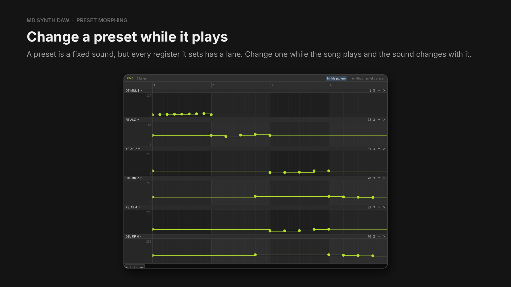

A preset is a fixed sound, but every register it sets has a lane. Change one while the song plays
and the sound changes with it.

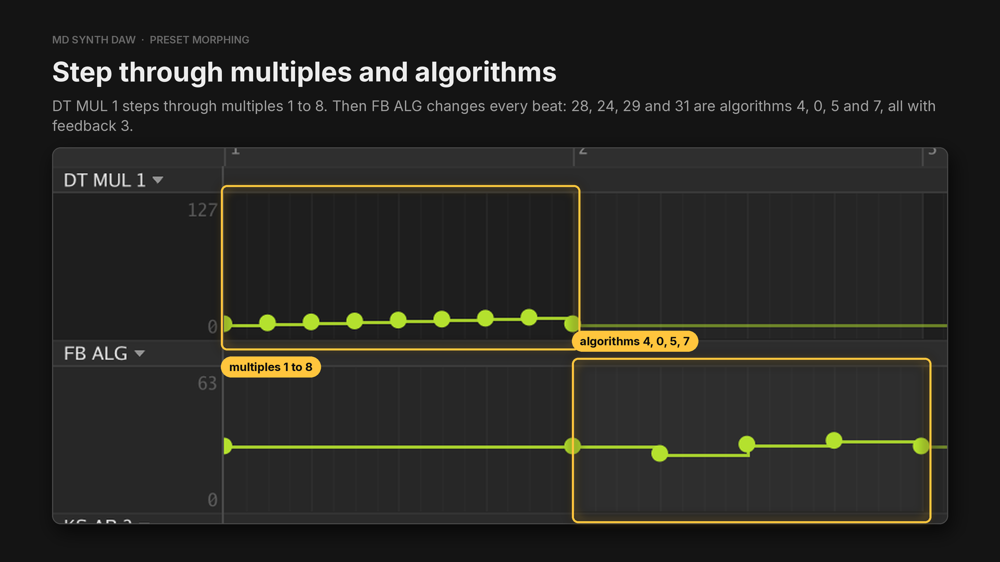

**Multiples and algorithms.** In Patch morphing (FM4, preset *Morph bell*, algorithm 4), `DT MUL 1`
steps through multiples 1 to 8, one per eighth note. Then `FB ALG` changes on every beat: 28, 24, 29
and 31 are algorithms 4, 0, 5 and 7, all with feedback 3.

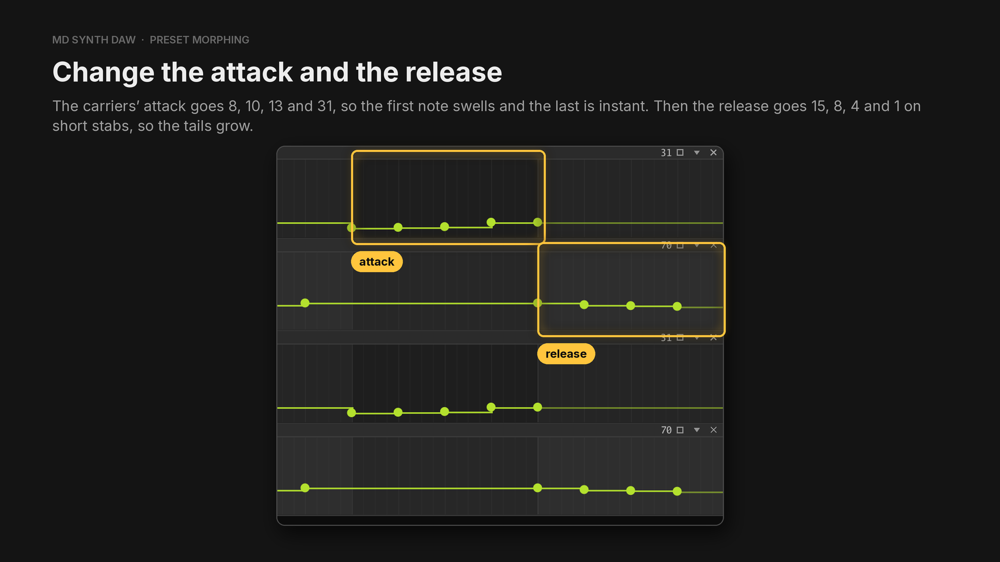

**Attack and release.** `KS AR 2` and `KS AR 4` set the carriers' attack to 8, 10, 13 and 31, one per
note. The first swells without ever reaching full level, the next two take about 275 ms and 125 ms,
and the last is instant. Then `D1L RR 2` and `D1L RR 4` set the release to 15, 8, 4 and 1 (values
79, 72, 68 and 65) on short stabs, so the tails grow longer.

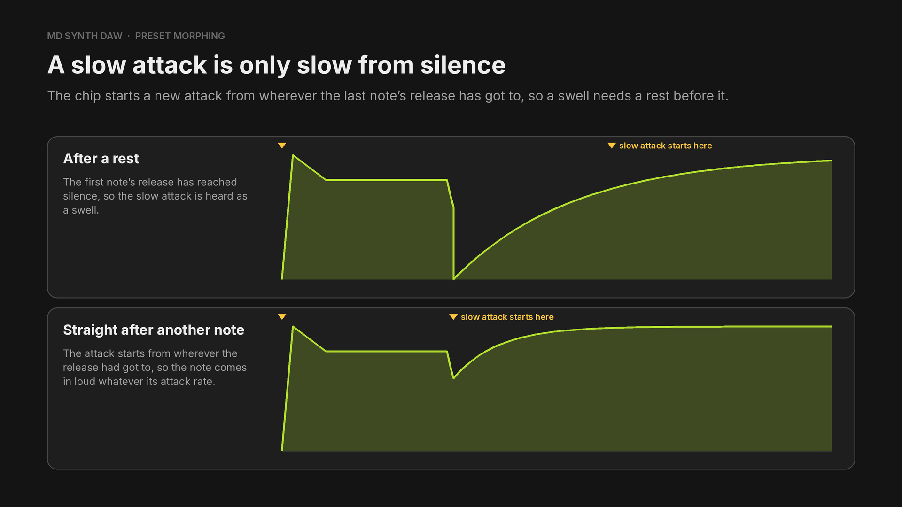

**A slow attack only sounds slow from silence.** The chip starts a new attack from wherever the
last note's release has got to, so a note played straight after another comes in loud whatever its
attack rate. That's why the attack notes in the example are short, with rests between them.

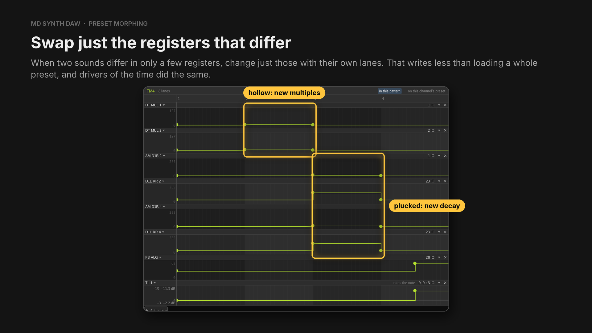

**Swap just the registers that differ.** When two sounds differ in only a few registers, change just
those with their own lanes. That is fewer writes to the chip than loading a whole preset, and sound
drivers of the time did the same. In Manual preset swapping (FM4, preset *Plain lead*), every lane
starts with a point holding the preset's own value. Bar 2 turns hollow when `DT MUL 1` becomes 3
and `DT MUL 3` becomes 5. Bar 3 turns plucked: the multiples go back, `AM D1R 2` and `4` become 12,
and `D1L RR 2` and `4` become 151, sustain level 9 with the same release.

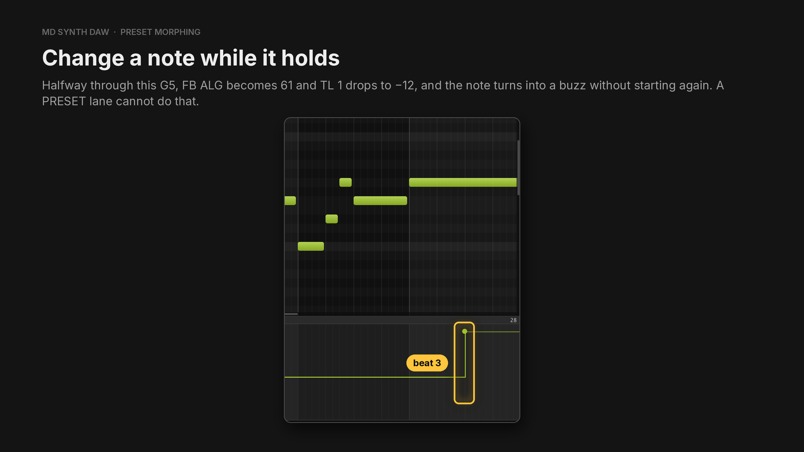

**Change a note while it holds.** In bar 4, one held G5 plays the plain preset. Halfway through, on
beat 3, `FB ALG` becomes 61 (feedback 7, algorithm 5) and `TL 1` drops to −12, and the note turns
into a buzz without starting again. A `PRESET` lane can't do that.

(<a href="#top">back to top</a>)

---

## 28. Preset swapping, and presets that move

**Hear it:** [Preset swapping](examples/07-preset-swapping.opus)

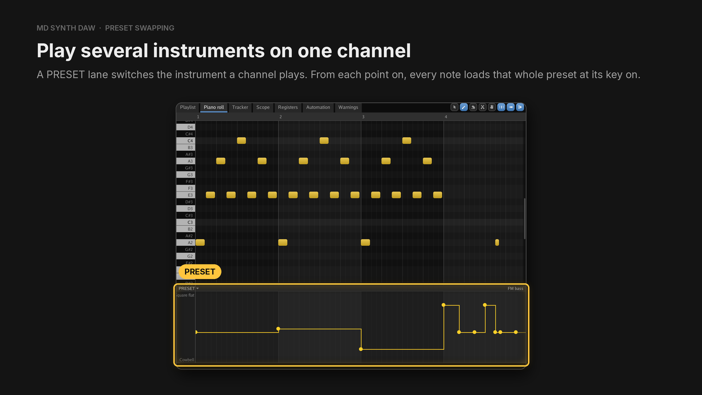

**Play several instruments on one channel.** Six FM channels, or five with drum samples, never feel
like enough. A `PRESET` lane switches the instrument a channel plays: from each point on, every note
loads that whole preset at its key on, the way a sound driver changes voice.

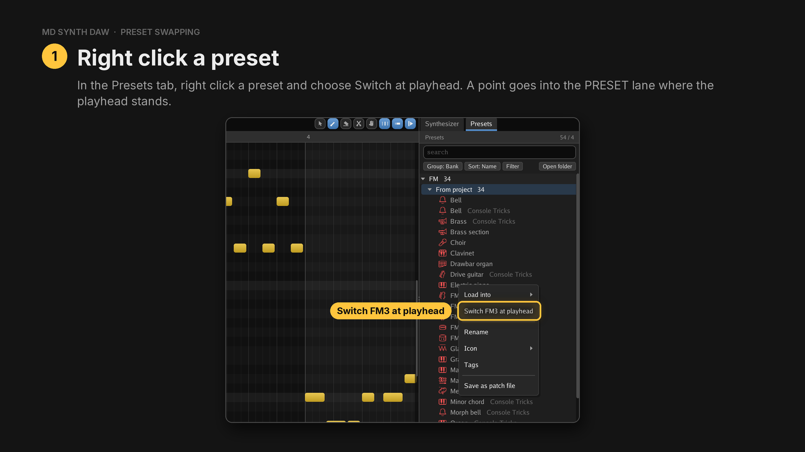

1. **Right click a preset** in the Presets tab and choose **Switch at playhead**. A point goes into
   the `PRESET` lane where the playhead stands.

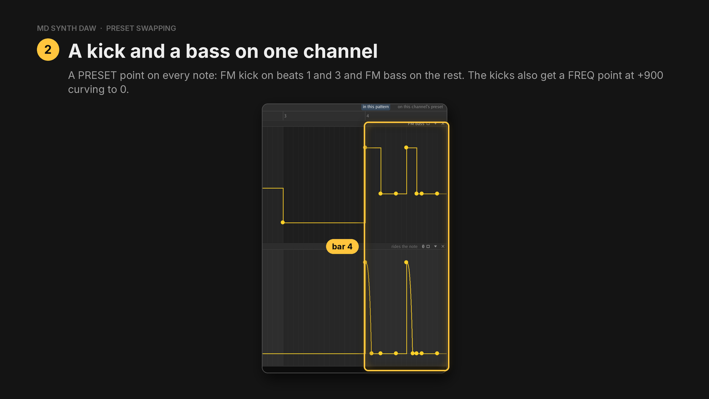

2. **A kick and a bass on one channel.** The example plays the same riff on FM3 as *FM bass*,
   *Organ* and *Brass* in bars 1 to 3. Bar 4 puts a `PRESET` point on every note: *FM kick* on beats
   1 and 3 and *FM bass* on the rest. The kicks also get a `FREQ` point at +900 curving to 0 over 30
   ticks, and the bass notes a point at 0.

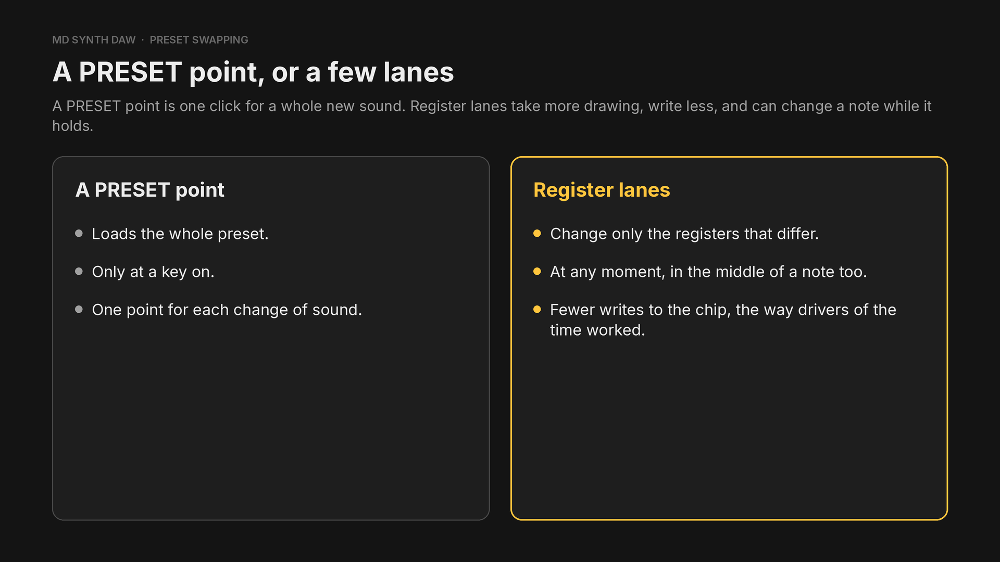

**A PRESET point, or a few lanes.** A `PRESET` point is one click for a whole new sound, and it
waits for the next key on. Register lanes take more drawing, write less, and can change a note while
it holds, as [Changing a preset while it plays](#27-changing-a-preset-while-it-plays) shows.

### Presets that move on every note

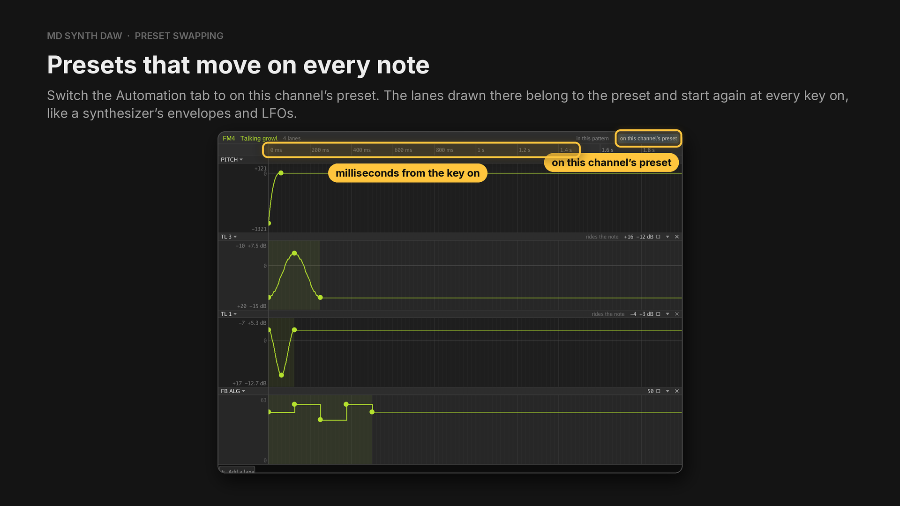

Switch the Automation tab to **on this channel's preset**. The lanes you draw there belong to the
channel's preset rather than to the pattern, and every note the preset plays starts them again at
its key on. The ruler reads milliseconds from the key on. A preset's `PITCH` lane is in cents, 1200
to an octave, so a drop follows whichever note plays it.

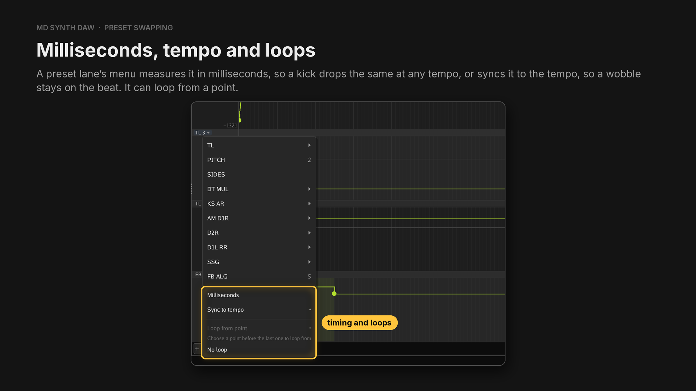

A lane's menu measures it in **Milliseconds**, so a kick drops the same way at any tempo, or **Sync
to tempo**, so a wobble stays on the beat. **Loop from point** repeats it from the chosen point for
as long as the note sounds. On an FM channel the lanes run on through the release, until they end,
the channel plays its next note, or two seconds have passed.

In the Presets tab, search `tag:moving` to find the presets in Default that move this way: kicks,
a reese, a growl, a wobble and a laser among them. *Talking growl*, in the picture, moves its pitch,
two operator levels and its feedback on every note.

(<a href="#top">back to top</a>)

---

## 29. Chords and arpeggios

**Hear it:** [Chords](examples/09-chords.opus) ·
[Arpeggios](examples/10-arpeggios.opus)

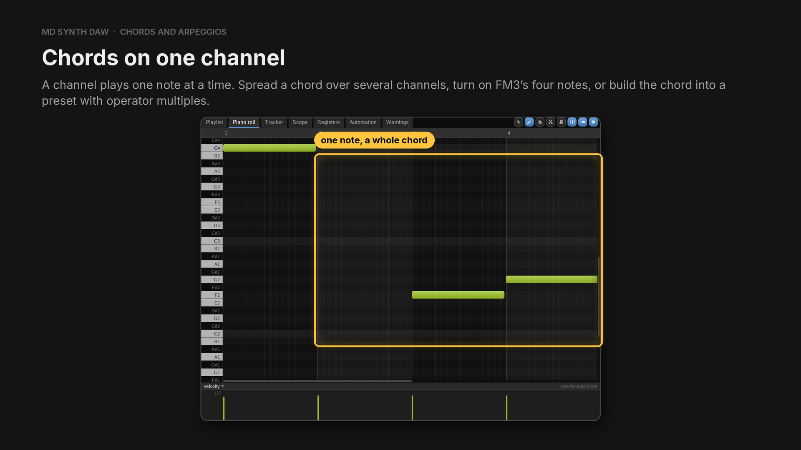

Each channel plays one note at a time. There are three ways to a chord: spread it over several
channels, switch on FM3's four notes, or build it into a preset with operator multiples.

### FM3 four notes

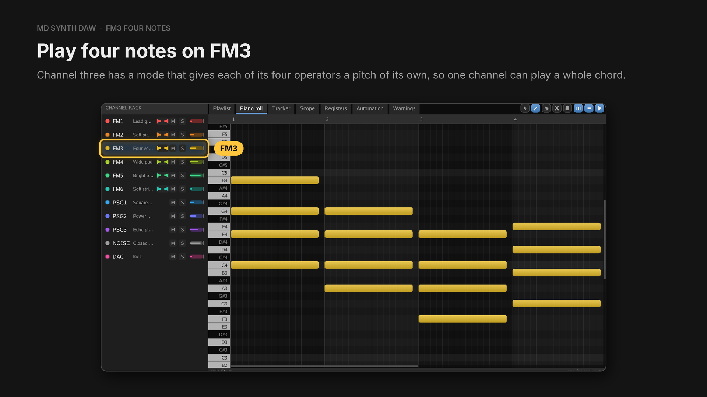

Channel three has a mode that gives each of its four operators a pitch of its own, so one channel
can play a whole chord.

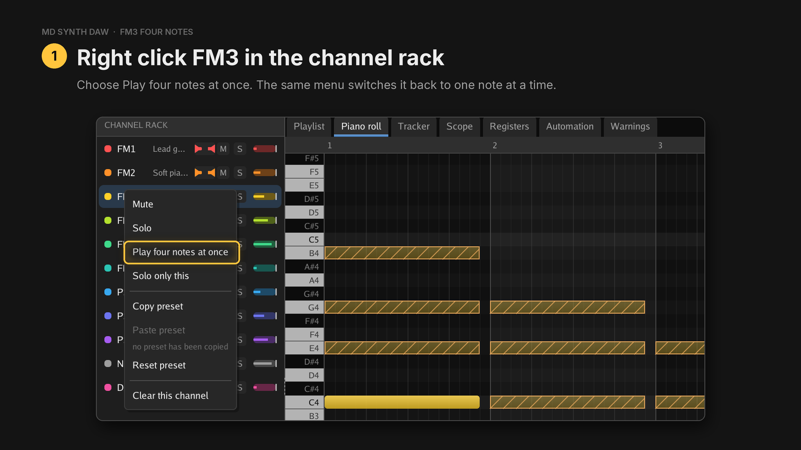

1. **Right click FM3** in the channel rack and choose **Play four notes at once**. The same menu
   switches it back to one note at a time.

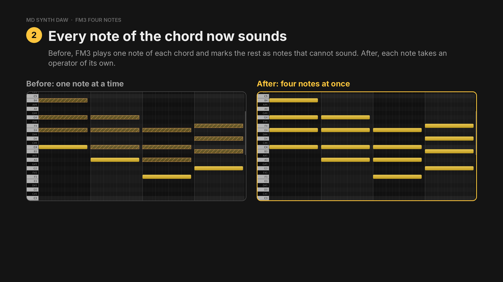

2. **Every note of the chord now sounds.** Before, FM3 plays one note of each chord and marks the
   rest as notes that can't sound. After, each note takes an operator of its own.

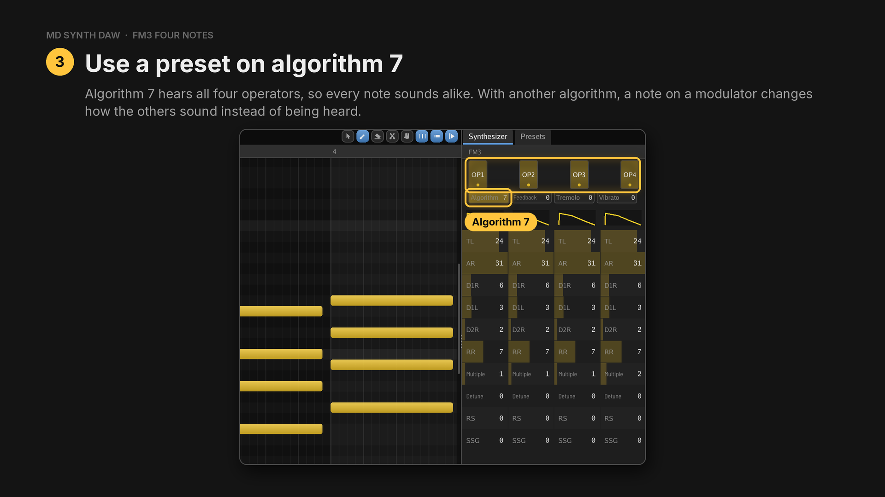

3. **Use a preset on algorithm 7.** Algorithm 7 hears all four operators, so every note sounds
   alike. With another algorithm, a note on a modulator changes how the others sound instead of
   being heard.

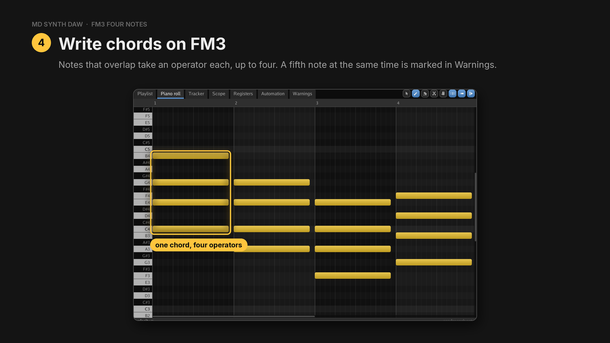

4. **Write chords on FM3.** Notes that overlap take an operator each, up to four. A fifth note at the
   same time is marked in Warnings. The `OP1 FREQ`, `OP2 FREQ` and `OP3 FREQ` lanes set one
   operator's pitch exactly, and VGM exports keep the mode.

### Chords from operator multiples

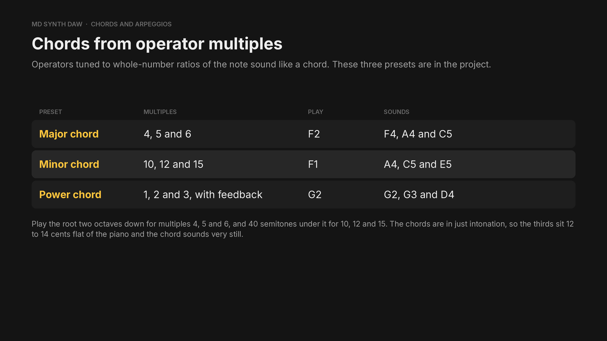

Operators tuned to whole number ratios of the note sound like a chord. Console Tricks has three
such presets. For multiples 4, 5 and 6, play the root two octaves down. For 10, 12 and 15, play the
note 40 semitones under the root, three octaves and a major third. The chords are in just
intonation, so the third of the major chord and the outer notes of the minor one sit about 12 to 14
cents flat of the piano, which makes them sound very still.

**In the Chords example:**

- **Bar 1:** C major over four channels: C4 and E4 on FM4 and FM5, G4 and C5 on PSG1 and PSG2.
- **Bar 2:** A minor on FM4 alone, preset *Minor chord*: the note F1 sounds A4, C5 and E5.
- **Bar 3:** F major on FM4 alone, preset *Major chord*: F2 sounds F4, A4 and C5.
- **Bar 4:** a G power chord on FM4 alone, preset *Power chord*: G2 sounds G2, G3 and D4.

Measured, bar 2's peaks are at 436, 524 and 655 Hz and bar 3's at 349, 436 and 524 Hz.

### Arpeggios

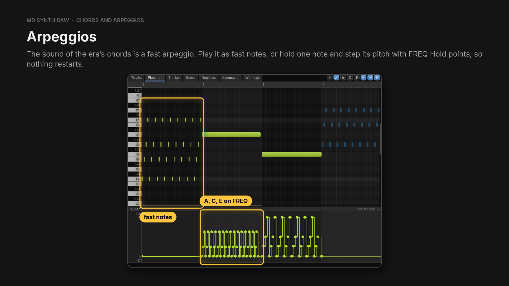

The sound of the era's chords is a fast arpeggio. Play it as fast notes, or hold one note and step
its pitch with `FREQ` Hold points, so nothing restarts.

- **Bar 1:** C major as thirty second notes on FM4 (preset *Organ*). Every note is a key on and ends
  a sixty fourth early, so it chops.
- **Bar 2:** one A4 held on FM4, with Hold points every 8 ticks on `FREQ` cycling 0, 205 and 540,
  which are A, C and E. It's smooth, because nothing restarts.
- **Bar 3:** one F4 held, stepping 0, 223, 428 and 859 every 12 ticks: F, A, C and the F above.
- **Bar 4:** G major as thirty second notes on PSG1 (preset *Square lead*). A square has no key on
  to click, so fast notes are clean there.

(<a href="#top">back to top</a>)

---

## 30. Echo and sidechain

**Hear it:** [Echo](examples/12-echo.opus) ·
[Sidechain](examples/14-sidechain.opus)

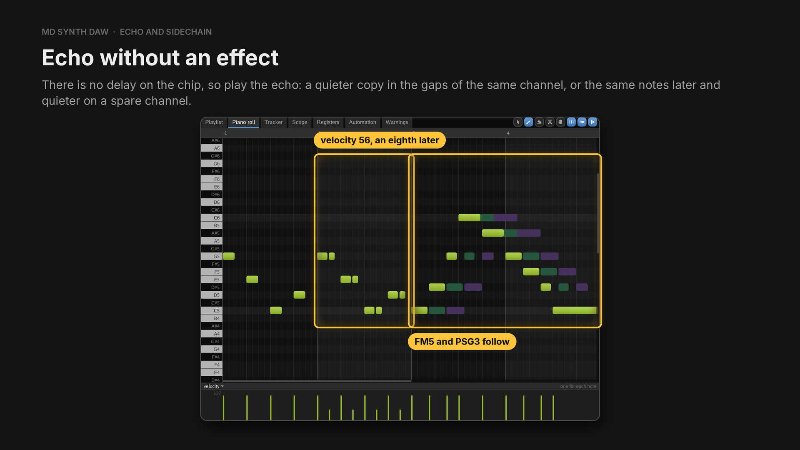

**Echo without an effect.** There is no delay on the chip, so play the echo yourself. In the example
(preset *FM pluck*), bar 1 is dry on FM4. In bar 2 a quieter copy of each note, velocity 56, comes
an eighth later and fills the gap before the next one. In bars 3 and 4, FM4 plays a longer phrase
panned left, FM5 plays the same notes panned right a dotted eighth (72 ticks) later at velocity 72,
and PSG3 plays them a dotted quarter (144 ticks) later on *Square pluck*.

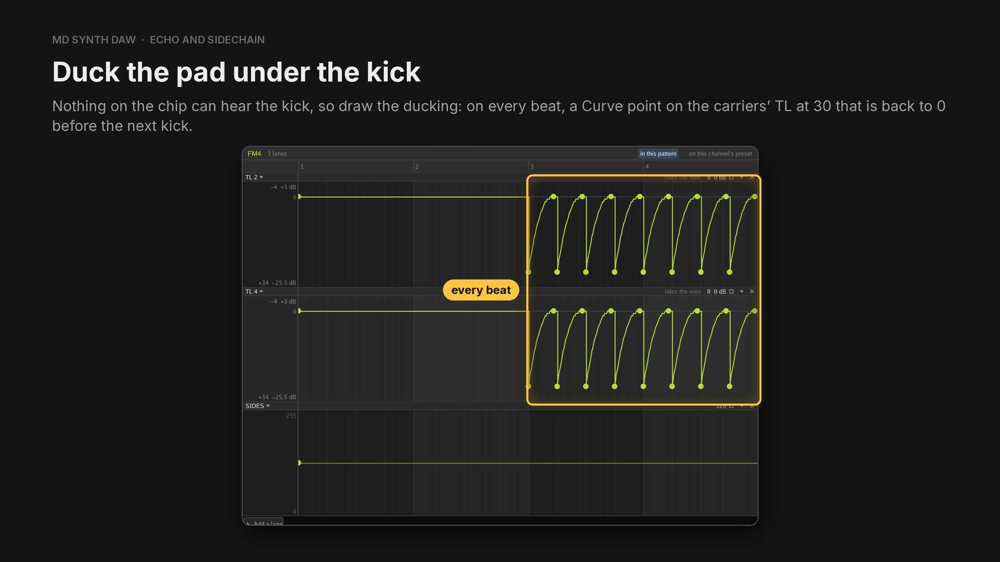

**Duck the pad under the kick.** There is no compressor, and nothing on the chip can hear the kick,
so draw the ducking yourself. The example plays the Drum Kit's kick on every beat, *Pad* on FM4 and
FM5 and *Square flat* on PSG1 and PSG2. Bars 1 and 2 have no ducking. In bars 3 and 4, on every beat,
`TL 2` and `TL 4` on FM4 and FM5 get a Curve point at 30 that returns to 0 by tick 84, seven eighths
of the beat, and the squares' `LEVEL` lanes do the same from 8. Measured above 400 Hz, where the
kick hardly reaches, bar 2 holds steady and bar 4 dips about 11 dB on every beat.

(<a href="#top">back to top</a>)

---

## 31. Squares, noise, drums and samples

### Square swells

**Hear it:** [Square swells](examples/15-square-swells.opus)

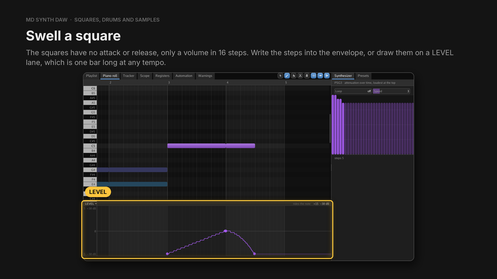

The squares have no attack, decay or release, only a volume in 16 steps. Either write the steps into
the instrument's envelope, or draw them on a `LEVEL` lane.

- **Bar 1:** *Square pluck* on PSG1 and PSG2, whose envelope steps down to decay the note.
- **Bar 2:** *Slow square*, whose envelope steps from 15 down to 3, 6 frames a step, so the chord
  swells in over about a second.
- **Bar 3:** a note on PSG3 with a `LEVEL` lane running Linear from 15 to 0 over the bar. Unlike an
  envelope, a lane is exactly one bar long at any tempo.
- **Bar 4:** PSG3 fades out with a Curve, while the noise channel plays *Cymbal swell* with its
  `LEVEL` curving the other way: a reverse cymbal.

The envelope examples and the lane examples are on different squares, because a `LEVEL` lane
replaces the envelope for that channel in the whole pattern.

### FM drums

**Hear it:** [FM drums](examples/16-fm-drums.opus)

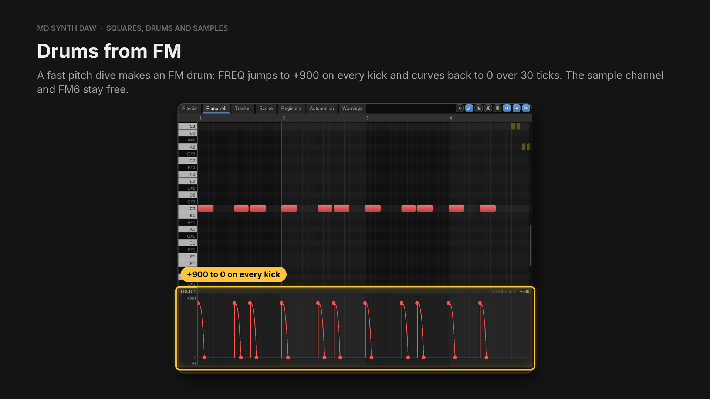

Drum samples take FM6, and the sample channel plays one sample at a time. Instead, make the drums
from FM with a fast pitch dive, and layer the noise channel where you need a rattle.

- **Kick** on FM1, preset *FM kick*: `FREQ` jumps to +900 on every hit and curves to 0 over 30 ticks.
- **Snare** on FM2, preset *FM snare*, with `FREQ` +200 falling to 0, and the noise channel playing
  *Noise snare* on the same beats.
- **Hats** on the noise channel between the snares.
- **Toms** on FM3 in bar 4, preset *FM tom*, each diving from +320.

The sample channel stays free, and so does FM6.

### Pitched noise

**Hear it:** [Pitched noise](examples/17-pitched-noise.opus)

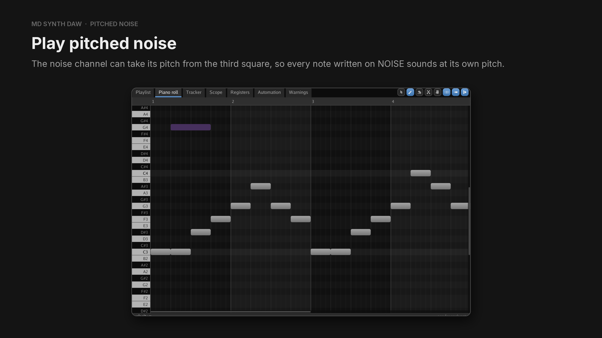

The noise channel has three fixed speeds, so on its own it can't play a tune. Two of its modes
follow the third square's pitch instead.

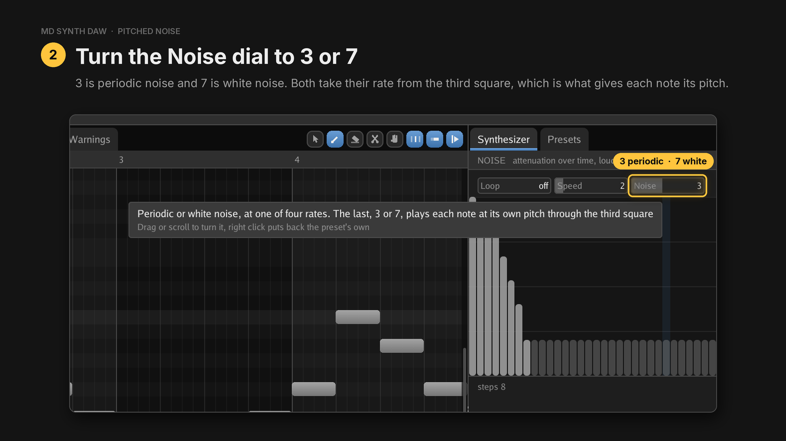

1. **Choose NOISE** in the channel rack, and in its preset turn the **Noise** dial to **3** for
   periodic noise or **7** for white noise.
2. **Write notes on NOISE.** Each one plays at its own pitch.

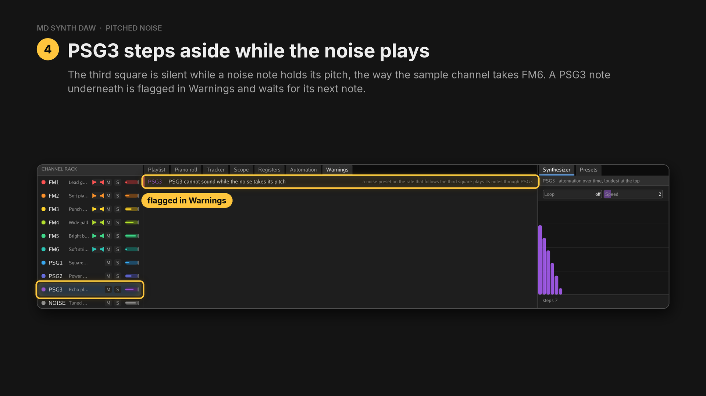

The third square gives the noise its pitch, so PSG3 is silent while a noise note sounds. Periodic
noise sounds 3 octaves under the square that clocks it, and the app tunes the square to allow for
it.

### Sharing channel six

**Hear it:** [Sharing channel six](examples/18-sharing-channel-six.opus)

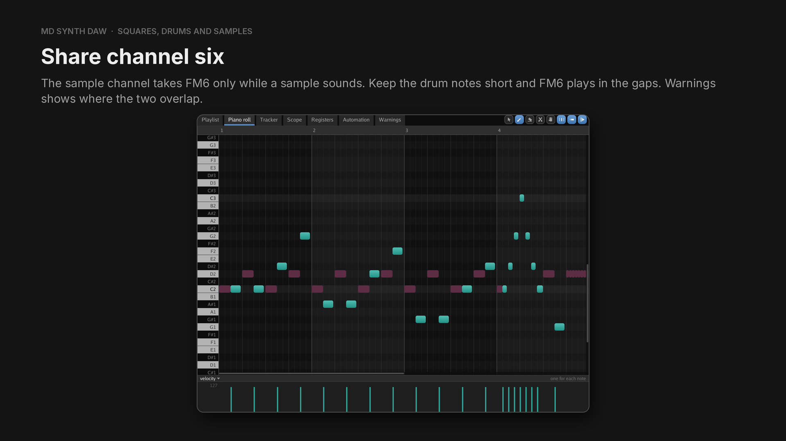

The sample channel takes FM6 only while a sample is actually sounding. Keep the drum notes short and
FM6 plays in the gaps between them. In the example, kick and snare play eighth notes on every beat
and FM6 plays a bass note (*FM bass*) on every offbeat, ending before the next drum starts. Where an
FM6 note overlaps a sample note, Warnings says so, because the sample will cut it off.

### Sample stutter

**Hear it:** [Sample stutter](examples/19-sample-stutter.opus)

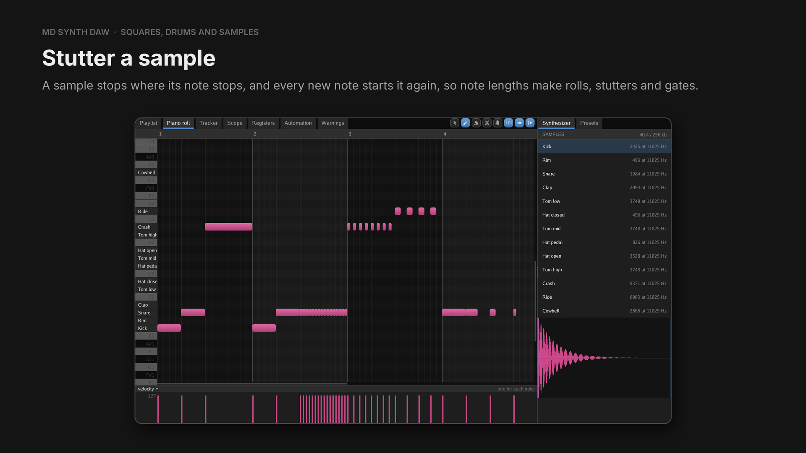

The sample channel plays a sample at the rate it was recorded, with no pitch or volume control. Note
lengths are what you have: a sample stops where its note stops, and every new note starts the sample
again from the beginning.

- **Bar 1:** kick, snare and crash on long notes, so each plays to its end.
- **Bar 2:** kick and snare, then 16 snare notes a thirty second long each: a roll that restarts the
  snare every time.
- **Bar 3:** the crash as eight notes, each 12 ticks long on a sixteenth grid, so it stutters on its
  attack. Then the ride on every eighth, cut to a sixteenth, which gates it.
- **Bar 4:** a snare on every beat, a quarter, an eighth, a sixteenth and a thirty second long. The
  shorter the note, the tighter the snare.

(<a href="#top">back to top</a>)

---

## 32. Every example

Each example is 10 seconds: four bars at 120 bpm and a bar of rest. The audio of each is summed from
its own channels, so the tail of the example before it is left out.

| # | Example | Channels | Listen |
| --- | --- | --- | --- |
| 1 | Vibrato | FM4 | [listen](examples/01-vibrato.opus) |
| 2 | Bends and slides | FM4 | [listen](examples/02-bends-and-slides.opus) |
| 3 | Tremolo and gate | FM4 | [listen](examples/03-tremolo-and-gate.opus) |
| 4 | Distortion | FM1 | [listen](examples/04-distortion.opus) |
| 5 | Filter sweep | FM1 | [listen](examples/05-filter-sweep.opus) |
| 6 | Patch morphing | FM4 | [listen](examples/06-patch-morphing.opus) |
| 7 | Preset swapping | FM3 | [listen](examples/07-preset-swapping.opus) |
| 8 | Manual preset swapping | FM4 | [listen](examples/08-manual-preset-swapping.opus) |
| 9 | Chords | FM4, FM5, PSG1, PSG2 | [listen](examples/09-chords.opus) |
| 10 | Arpeggios | FM4, PSG1 | [listen](examples/10-arpeggios.opus) |
| 11 | Unison detune | FM4, FM5 | [listen](examples/11-unison-detune.opus) |
| 12 | Echo | FM4, FM5, PSG3 | [listen](examples/12-echo.opus) |
| 13 | Simulated panning | FM4, FM5 | [listen](examples/13-simulated-panning.opus) |
| 14 | Sidechain | FM4, FM5, PSG1, PSG2, DAC | [listen](examples/14-sidechain.opus) |
| 15 | Square swells | PSG1, PSG2, PSG3, noise | [listen](examples/15-square-swells.opus) |
| 16 | FM drums | FM1, FM2, FM3, noise | [listen](examples/16-fm-drums.opus) |
| 17 | Pitched noise | noise, with PSG3 setting its pitch | [listen](examples/17-pitched-noise.opus) |
| 18 | Sharing channel six | FM6, DAC | [listen](examples/18-sharing-channel-six.opus) |
| 19 | Sample stutter | DAC | [listen](examples/19-sample-stutter.opus) |

(<a href="#top">back to top</a>)

---

## 33. Quick reference

**F number of each note**, the same in every octave:

| C | C♯ | D | D♯ | E | F | F♯ | G | G♯ | A | A♯ | B |
| --- | --- | --- | --- | --- | --- | --- | --- | --- | --- | --- | --- |
| 644 | 682 | 723 | 766 | 811 | 859 | 910 | 965 | 1022 | 1083 | 1147 | 1215 |

**FREQ for an interval:** multiply the note's F number by

| Semitones | 1 | 2 | 3 | 4 | 5 | 7 | 12 |
| --- | --- | --- | --- | --- | --- | --- | --- |
| Up | 0.059 | 0.122 | 0.189 | 0.260 | 0.335 | 0.498 | 1 |
| Down | −0.056 | −0.109 | −0.159 | −0.206 | −0.251 | −0.333 | −0.5 |

`PERIOD` moves a square in period steps instead, and runs the other way: a bigger number is a lower
pitch.

**SIDES**

| Value | Plays |
| --- | --- |
| 128 | left only |
| 64 | right only |
| 192 | both outputs |
| 197 | both, with vibrato depth 5 |
| 240 | both, with tremolo depth 3 |

**LFO speeds at 60 Hz:** 3.85, 5.4, 5.86, 6.21, 6.71, 9.46, 52.0 and 83.2 Hz.

**One TL step** is 0.75 dB.

**Ticks:** 96 to a beat, 384 to a bar.

(<a href="#top">back to top</a>)

